# 🟢 Track 1. Day 1 Value — 핵심 업무 실무 가치

> [!NOTE]
> **트랙 개요**: 별도의 복잡한 개발이나 인프라 연동 없이 웹 브라우저에서 즉시 체감하는 Gemini Enterprise 실무 핸즈온 과정입니다. 전사 임직원 및 입문자, 영업/마케팅/기획 실무진을 위한 AI 어시스턴트, 실시간 검색 그라운딩, 이미지/비디오 생성, 파일 분석, Canvas 슬라이드 제작 및 표준 프롬프트 프레임워크를 학습합니다.

> [!TIP]
> **실습 첨부파일 다운로드**
> - [📊 엑셀 매출 데이터 (coffee orders.xlsx)](samples/coffee%20orders.xlsx)
> - [📑 BigQuery 신규 기능 보고서 (202603-BigQuery New Feature Update.pptx)](samples/202603-BigQuery%20New%20Feature%20Update.pptx)
> - [🖼️ 손그림 아키텍처 스케치 (handwrite_arch.png)](samples/handwrite_arch.png)
> - [🌐 Track 1 인터랙티브 웹 포털 열기](https://geap.dev/track1.html)
> - [📽️ Track 1 16:9 발표 슬라이드 열기](https://geap.dev/slide_track1_v2.html)

---

## 1.1. 시작하기

> [!TIP]
> ➕ **New chat (새 대화창 열기)**: 실습 시작 전 좌측 상단의 **New chat (새 대화창 열기)** 버튼을 눌러 깨끗한 새 대화창에서 설정을 진행하세요.

본격적인 실습에 앞서 나만의 업무 환경과 직무에 최적화된 초기 설정을 진행합니다.

### 1) 나만의 Gemini Enterprise 설정 (개인화)

1. 화면 좌측 하단의 **Settings & help > Personalization** 메뉴를 클릭합니다.

   

2. 직무와 소속에 알맞은 맞춤형 답변을 받을 수 있도록 아래 정보를 입력합니다.
   - **선호하는 이름**: (예: `홍길동`)
   - **내 직무**: (예: `롯데백화점 마케팅 기획자`)
   - **우리 회사 산업군**: (예: `백화점 / 유통`)

   

3. 대화 맥락을 기억해 연속적인 답변을 얻을 수 있도록 **Conversation history**와 **Reference saved memories** 옵션을 모두 켭니다.

   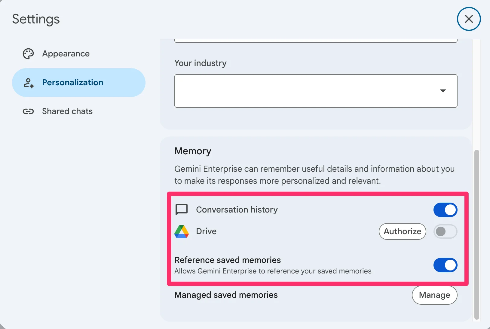

> [!TIP]
> **개인화된 컨텍스트(pContext - Personalized Context)란?**  
> Gemini Enterprise는 사용자의 업무 환경과 맥락을 이해하고 적절한 답변을 제공하기 위해 백그라운드에서 개인 맞춤형 문맥(pContext)을 생성하고 실시간 업데이트합니다.
> - **4대 분석 대상 소스 (최근 30일 내외 기준)**:
>   1. **사내 업무 시스템 및 Office 365** (Outlook, Teams, OneDrive/SharePoint)
>   2. **Knowledge Graph** (사내 조직도 및 보고 체계 포함)
>   3. **사용자 개인화 프로필** (설정에서 입력한 이름, 역할, 직무, 산업군)
>   4. **Gemini Enterprise 대화 내역 및 위치 정보**

---

### 2) UI 개인화 메뉴 옵션 추가

1. 화면 좌측 하단의 **Settings & help > Appearance** 탭을 열고 **Homepage elements** 항목에서 홈 화면에 표시할 메뉴를 모두 체크합니다.

   

2. 설정이 반영된 Gemini Enterprise 홈 화면입니다. **Prompts, Shortcuts, For you, Notebooks** 퀵 메뉴가 정상 표시되는지 확인합니다.

   

---

## 1.2. AI 어시스턴트

> [!TIP]
> ➕ **New chat (새 대화창 열기)**: 실습 시작 전 좌측 상단의 **New chat (새 대화창 열기)** 버튼을 눌러 이전 대화와 분리된 새 세션에서 진행하세요.

Gemini로 실제 업무 기획안을 도출하고, 팀원들과 안전하게 공유하고 협업하는 프로세스를 학습합니다.

> [!NOTE]
> **실무 시나리오: 글로벌 럭셔리 백화점 공간 혁신 및 팝업스토어 트렌드 분석**  
> 글로벌 리테일 및 럭셔리 브랜드 마케팅 전문가의 관점으로 해외 선도 백화점의 공간 혁신 및 팝업스토어 트렌드를 분석하고, 롯데백화점 적용 방안을 팀원들과 공유 링크로 협업합니다.

### 1) 실전 실습 1: 글로벌 럭셔리 백화점 공간 혁신 및 팝업스토어 트렌드 분석

1. 대화창에 아래의 역할 기반 구조화 프롬프트를 입력하여 실행합니다.

```markdown
[Role] 너는 10년 차 글로벌 리테일 및 럭셔리 브랜드 마케팅 전문가야.
[Context] 롯데백화점 주요 점포의 프리미엄 공간 리뉴얼과 글로벌 명품 팝업스토어 유치를 준비하며 글로벌 경쟁 지형을 분석 중이야.
[Action] 최근 프랑스, 영국, 일본 등 글로벌 선도 백화점(라파예트, 해롯, 이세탄 등)의 공간 혁신 및 팝업 마케팅 최신 트렌드를 검색하여 요약해 줘. 주요 백화점들의 집객 소구점(Selling Point)과 차별화 전략을 비교하고, 롯데백화점에 적용할 수 있는 전략 인사이트를 제시해 줘.
[Format] 1. 글로벌 리테일 트렌드 3줄 요약, 2. 해외 백화점 혁신 사례 비교 분석표, 3. 롯데백화점 적용 실행 방안 순서로 정리해 줘.
```

| 쿼리 결과 화면 | Source 출처 검증 화면 |
| :---: | :---: |
| 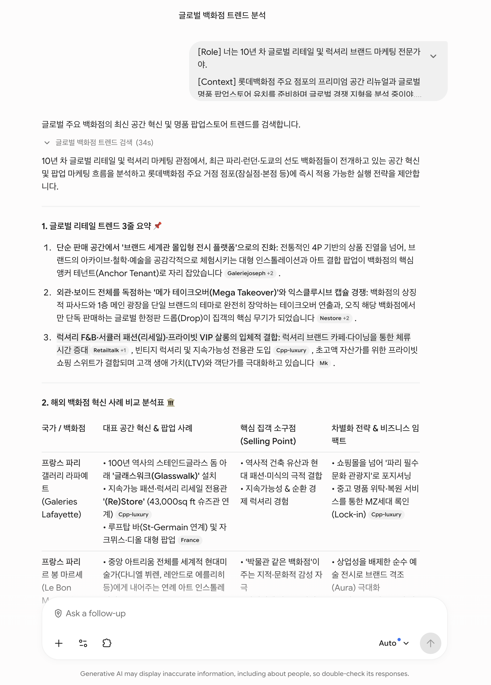 | 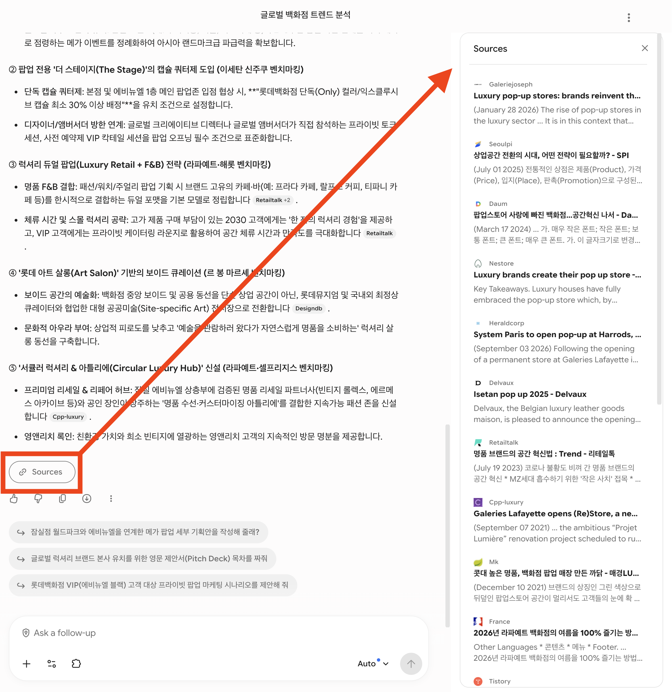 |

2. **Source(출처) 검증**: 생성된 결과 하단의 출처 링크를 클릭하여 답변의 근거가 된 글로벌 시장 리포트 및 기사를 실시간으로 확인합니다.
3. **인용 및 후속 꼬리 질문(Follow-up)**: 단락을 마우스로 드래그하여 선택하고 활성화되는 툴팁을 통해 세부 꼬리 질문을 이어갑니다.
4. **@멘션 및 다국어 번역 / Gmail 연동**:
   - `@Deep Research` 등 전문 에이전트나 문서를 즉시 호출 가능
   - 38개국 언어 실시간 번역 및 Gmail 이메일 초안 자동 변환
   - 생성된 표 데이터는 원클릭으로 엑셀(.xlsx) 파일 다운로드 지원

---

### 2) 실전 실습 2: 대화 세션 공유 및 팀 협업

1. 대화 세션 우측 상단의 **Share** 아이콘을 클릭합니다.
2. **Create public link** 창에서 생성된 단축 URL을 복사하여 팀 메신저나 이메일로 전달합니다.

| 대화 세션 공유 인터페이스 | 공유 링크 복사 |
| :---: | :---: |
| 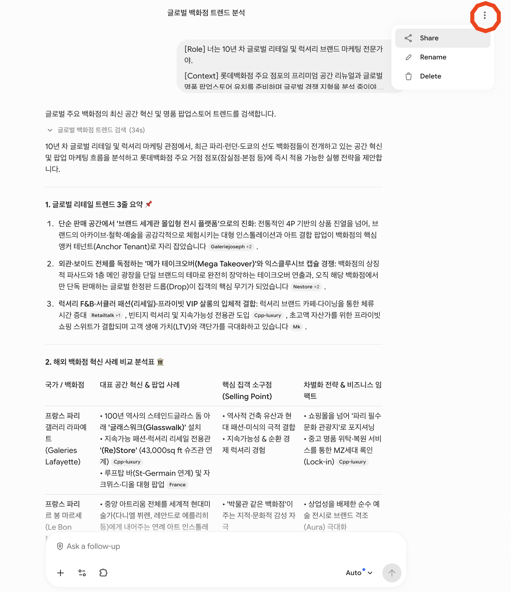 | 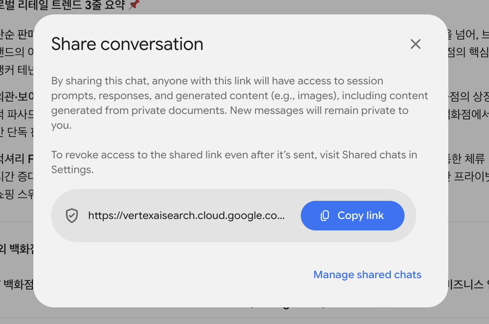 |

3. 전달받은 링크를 새 브라우저 창에서 열어 이전 맥락이 유지되는지 확인하고 추가 질문을 테스트합니다.
4. 공유한 대화는 좌측 하단 **Settings & help > Shared chats** 메뉴에서 언제든 확인하고 공유를 취소할 수 있습니다.

---

## 1.3. 실시간 웹 검색 (Google Search)

> [!TIP]
> ➕ **New chat (새 대화창 열기)**: 실습 시작 전 좌측 상단의 **New chat (새 대화창 열기)** 버튼을 눌러 이전 대화와 분리된 새 세션에서 진행하세요.

Google Search 엔진과 연결된 실시간 그라운딩(Grounding)을 통해 최신 정책, 뉴스, 웹페이지를 분석합니다.

> [!NOTE]
> **실무 시나리오: 글로벌 리테일 ESG 지속가능 정책 SWOT 분석 및 최신 리테일 테크 동향 파악**  
> 실시간 구글 검색을 통해 글로벌 유통 친환경 정책과 CES 2026 리테일 테크 동향을 수집하고 분석합니다.

### 1) 실전 실습 1: 글로벌 리테일 친환경 정책 및 롯데백화점 SWOT 분석

```markdown
[Context] 글로벌 유통 및 소비재(Retail) 산업에서 탄소 배출 저감, 제로 웨이스트, 친환경 패키징 및 지속가능 매장 인증 규제가 강화되고 있습니다.
[Action] 글로벌 대형 유통업체들의 최신 친환경·지속가능 매장 운영 사례와 ESG 정책 변화를 검색해 줘. 이러한 친환경 트렌드가 국내 오프라인 백화점 산업에 미칠 영향을 분석해 줘.
[Format] 롯데백화점 관점에서의 SWOT(강점, 약점, 기회, 위협) 분석 매트릭스 표로 정리하고, 최우선 대응 전략 2가지를 제시해 줘.
```

---

### 2) 실전 실습 2: CES 2026 리테일 테크 & 피지컬 AI 고객 경험 트렌드

```markdown
[Role] 너는 글로벌 유통 테크 수석 애널리스트야.
[Action] 최근 열린 CES 2026에서 발표된 리테일 테크(스마트 쇼핑, 피지컬 AI 기반 고객 동선 분석, 무인 결제, 생성형 AI 퍼스널 쇼퍼) 최신 동향을 웹 검색으로 분석해 줘.
[Format] 1. 핵심 리테일 테크 트렌드 3가지 요약, 2. 글로벌 선도 유통사 적용 사례, 3. 롯데백화점 VIP 고객 경험 혁신을 위한 마케팅 제언 3줄.
```

---

### 3) 실전 실습 3: 웹페이지 기반 대화 (Public URL 바인딩)

대화창에 분석하고 싶은 Public 웹페이지 URL을 붙여넣고 요약 및 시사점을 도출합니다.

```markdown
다음 웹페이지의 최신 내용을 실시간으로 읽고, 기술적 핵심 내용을 3줄로 요약한 뒤 우리 비즈니스에 시사하는 바를 설명해 줘: https://blog.google/technology/ai/
```

---

## 1.4. 이미지 및 비디오 생성 (Create Images & Video)

> [!TIP]
> ➕ **New chat (새 대화창 열기)**: 실습 시작 전 좌측 상단의 **New chat (새 대화창 열기)** 버튼을 눌러 이전 대화와 분리된 새 세션에서 진행하세요.

**Image**(이미지)와 **Video**(동영상) 모델을 활용하여 비즈니스 포스터, 아키텍처 다이어그램, 시네마틱 홍보 영상을 직접 제작합니다.

> [!NOTE]
> **시각화 실습: 비즈니스 이미지 및 시네마틱 루프 영상 제작**  
> 텍스트 프롬프트와 참조 이미지를 결합하여 기업용 광고, 클라우드 아키텍처 다이어그램 및 광고 영상을 생성합니다.

### 1) 실전 실습 1: Image 모델을 활용한 비즈니스 이미지 생성

화면 상단 **Tools** 패널에서 **Create images (이미지 생성)** 툴을 활성화합니다.

| 이미지 생성 메뉴 진입 | 이미지 생성 인터페이스 |
| :---: | :---: |
| 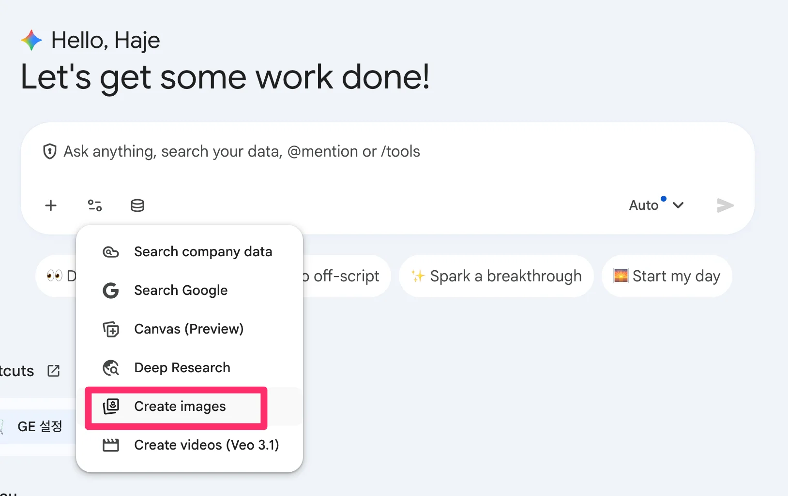 | 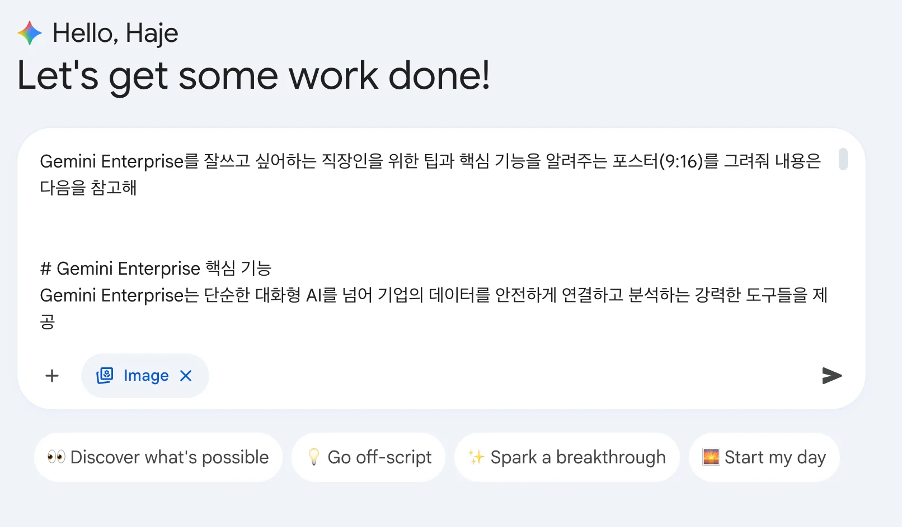 |

#### [시나리오 A] 엔터프라이즈 기능 홍보 포스터 (세로형 9:16)

```markdown
Gemini Enterprise를 잘 쓰고 싶어하는 직장인을 위한 팁과 핵심 기능을 알려주는 모던하고 세련된 인포그래픽 포스터(비율 9:16)를 그려줘.
내용 구성:
- AI Assistant & Web Search: 실시간 Google 검색 그라운딩 및 코드 작성
- Deep Research: 수백 개 소스 자율 분석 및 심층 리포트 생성
- Gemini Notebook: 사내 문서 기반 정확한 출처 검증 리서치
- Agent Designer: 노코드 맞춤형 AI 에이전트 빌딩
- Media Generation: 고해상도 비즈니스 이미지 및 동영상 즉각 생성
```

| 생성 포스터 예시 1 | 생성 포스터 예시 2 |
| :---: | :---: |
|  | 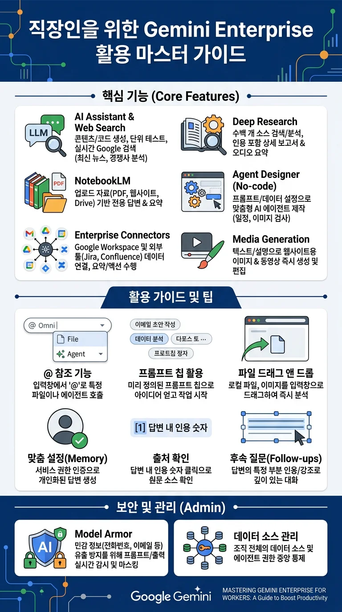 |

#### [시나리오 B] 손그림 스케치를 클라우드 정밀 아키텍처 다이어그램으로 변환 (Image-to-Image)

1. 실습용 손그림 샘플 파일([handwrite_arch.png](samples/handwrite_arch.png))을 대화창에 첨부합니다.
2. **Create images** 모드에서 아래 프롬프트를 실행합니다.

```markdown
첨부한 손그림 스케치 아키텍처를 Google Cloud 공식 Architecture Icon 스타일로 매우 전문적이고 세련된 고해상도 엔지니어링 다이어그램으로 다시 그려줘.
```


---

### 2) 실전 실습 2: Veo 모델을 활용한 시네마틱 영상 생성

> [!TIP]
> ➕ **New chat (새 대화창 열기)**: 비디오 생성 실습 전 좌측 상단의 **New chat (새 대화창 열기)** 버튼을 눌러 이전 대화와 분리된 새 세션에서 진행하세요.

대화 입력창의 **Tools** 패널에서 **Create videos (Veo 3.1)** 도구를 선택한 뒤 비디오 생성 프롬프트를 실행합니다.

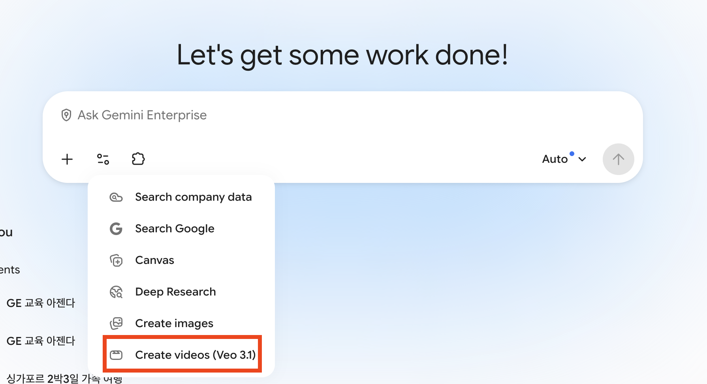

#### 시나리오 1. 럭셔리 향수 광고 (돌리 레프트 샷)

```markdown
향수병을 소개하는 고급스러운 홍보 영상을 만드세요. 호박색 액체로 채워진 투명한 유리 향수병의 각진 마개에 초점을 맞춰 밀착한 클로즈업 돌리 레프트 샷으로 동영상을 시작합니다. 유리병에 물방울이 은은하게 맺혀 있습니다. 병은 욕실의 깔끔한 흰색 대리석 위에 놓여 있습니다. 배경 창문에서 부드러운 자연광이 흘러들어옵니다. 전체적으로 우아하고 신선하며 세련된 분위기입니다.
```

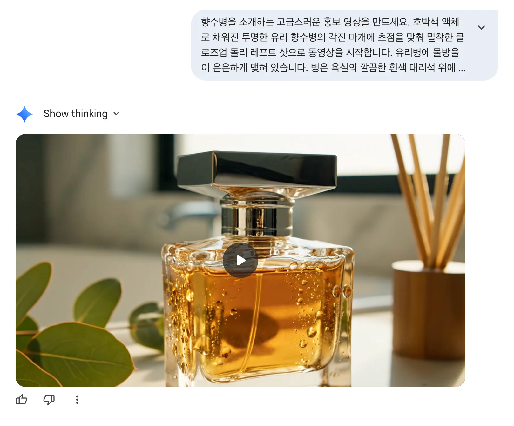

#### 시나리오 2. 치즈버거 슬로우 모션 (푸드 매크로 샷)

```markdown
꽉 눌려 짜지는 육즙 가득한 치즈버거의 익스트림 클로즈업 매크로 샷
- 상세 묘사: 녹아내린 치즈가 옆으로 천천히 흘러내림. 김이 모락모락 피어오름
- 촬영 기법: 전문적인 음식 사진 촬영, 하이 키 조명(high key lighting), 4k 해상도, 슬로우 모션
- 오디오: 지글거리는 소리, 경쾌하고 활기찬 음악
```


#### 시나리오 3. 폭포 FPV 드론 샷 (역동적인 자연 풍경)

```markdown
아이슬란드의 거대한 폭포 아래로 하강하는 빠른 FPV 드론 샷.
- 상세 묘사: 렌즈에 부딪히는 물방울. 안개와 무지개를 통과하며 비행함
- 촬영 기법: 역동적인 모션 블러, 속도감, 초현실적인 자연 다큐멘터리 스타일
- 오디오: 세차게 흐르는 물소리, 바람 소리
```

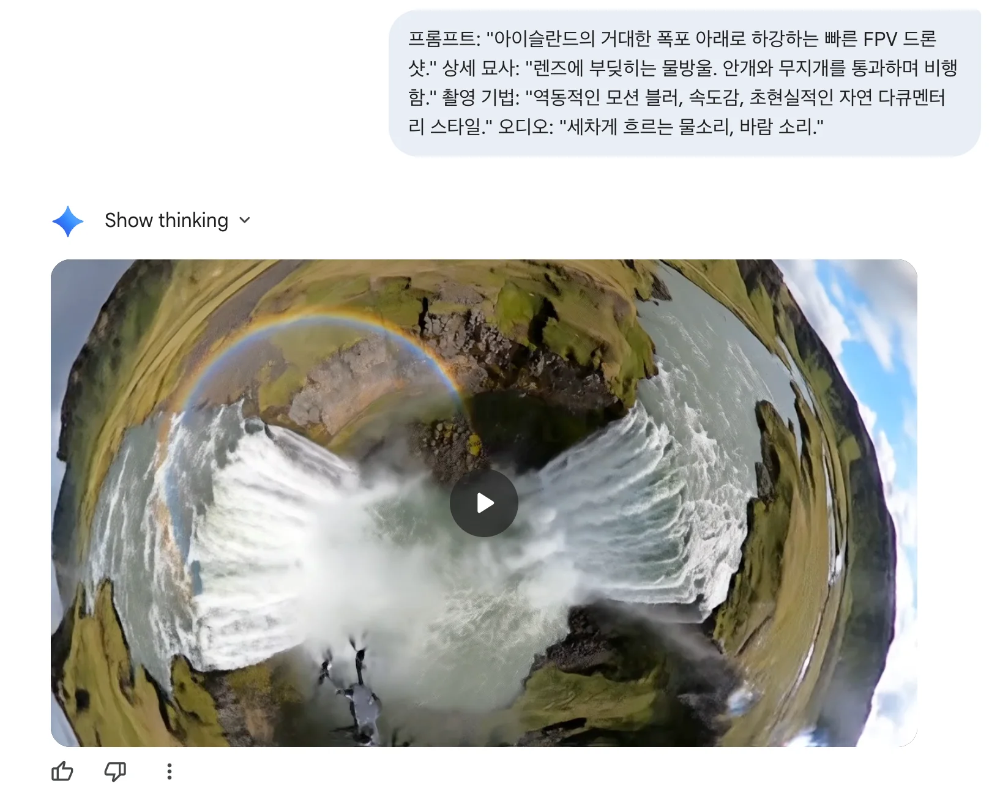

#### 시나리오 4. 90년대 레트로 VHS (스케이트보더)

```markdown
1990년대 VHS 미학. 스케이트보더가 교외의 거리에서 카메라를 스쳐 지나가며 빠르게 올리(ollie) 기술을 선보임.
- 상세 묘사: 수동 촬영 특유의 흔들림, 색 번짐(chroma bleeding), 날짜 스탬프 효과
- 오디오: 테이프 노이즈(tape hiss), 보드 바퀴 소리, 멀리서 개 짖는 소리
```


---

## 1.5. 엑셀 파일 분석

> [!TIP]
> ➕ **New chat (새 대화창 열기)**: 실습 시작 전 좌측 상단의 **New chat (새 대화창 열기)** 버튼을 눌러 이전 대화와 분리된 새 세션에서 진행하세요.

엑셀 파일을 대화창에 올리고 자연어로 질문하여 동적 차트와 통계 검증을 도출합니다.

- **실습 파일**: [coffee orders.xlsx](samples/coffee%20orders.xlsx) 다운로드 후 대화창 첨부

> [!NOTE]
> **데이터 분석 실습: 매출 현황 시계열 추이 분석 및 통계적 유의성 검정**  
> 주문완료일 기준 시계열 트렌드, 주문유형(Dine-in vs Takeaway)별 매출 기여도 및 t-test 유의성 검정을 자연어로 수행합니다.

> [!IMPORTANT]
> **Excel 분석 헤더 구조화 팁**
> - 열(Column) 헤더가 **반드시 첫 번째 행(1행)**에 위치해야 정확하게 파싱됩니다.
> - `(주문 완료일)`, `(Orders Total Sales)`처럼 시트상에 명시된 컬럼명을 괄호로 명시하면 더욱 정밀한 쿼리가 가능합니다.

### 1) 파일 구조 분석
```markdown
업로드한 엑셀 문서의 전체 데이터 구조를 파악하고, 어떤 분석과 인사이트를 도출할 수 있는지 요약해 줘.
```

### 2) 시계열 트렌드 분석
```markdown
(주문 완료일)을 기준으로 일별, 주별, 월별 매출(Orders Total Sales)의 변화 추이를 분석하여 매출이 가장 높은 시기와 낮은 시기의 특징을 파악해 줘.
```

| 매출 분석 파일 요약 | 시계열 차트 결과 |
| :---: | :---: |
|  | 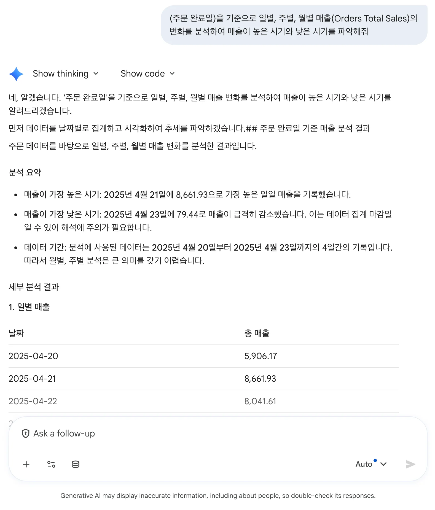 |

### 3) 주문유형 기여도 및 통계 검정
```markdown
(주문 유형: Dine-in, Takeaway)에 따른 매출 비중을 분석하고, 매장 내 식사와 포장 판매 간의 주문당 평균 매출 차이가 통계적으로 유의미한지 t-test 검정을 수행해 줘.
```

| 식사 유형 비교 차트 | t-test 통계 분석 결과 |
| :---: | :---: |
|  |  |

---

## 1.6. PPT 파일 분석

> [!TIP]
> ➕ **New chat (새 대화창 열기)**: 실습 시작 전 좌측 상단의 **New chat (새 대화창 열기)** 버튼을 눌러 이전 대화와 분리된 새 세션에서 진행하세요.

프레젠테이션 파일을 대화창에 업로드하여 핵심 요약 및 GA/Preview 출시 로드맵 분류 표를 자동 생성합니다.

- **실습 파일**: [202603-BigQuery New Feature Update.pptx](samples/202603-BigQuery%20New%20Feature%20Update.pptx) 다운로드 후 대화창 첨부

```markdown
[Role] 너는 10년 차 클라우드 솔루션 아키텍트야.
[Context] 첨부된 PowerPoint 보고서는 BigQuery의 최신 기능 업데이트 내역이야.
[Action] 발표 장표에 포함된 New Feature들을 핵심 기능별로 간결하게 요약해 줘.
[Format] 각 기능명, 핵심 요약, 그리고 출시 상태(GA vs Preview 여부)를 일목요연하게 3개 열의 마크다운 비교 표로 작성해 줘.
```


---

## 1.7. Canvas

> [!TIP]
> ➕ **New chat (새 대화창 열기)**: 실습 시작 전 좌측 상단의 **New chat (새 대화창 열기)** 버튼을 눌러 이전 대화와 분리된 새 세션에서 진행하세요.

Gemini Enterprise Canvas를 활용하여 아키텍처 요구사항을 바탕으로 비즈니스 슬라이드 및 보고서 장표(PPTX/PDF)를 자동 생성합니다.

> [!NOTE]
> **Canvas 실습: 프레젠테이션 & 보고서 자동 생성 (PPTX 내보내기 지원)**  
> 요구사항 텍스트를 기반으로 슬라이드 장표를 자동 빌딩하고, 전문 기술문서 및 기업 브랜드 템플릿으로 확장합니다.

### 1) 실전 실습 1: GCP 백엔드 아키텍처 비즈니스 슬라이드 생성

```markdown
새로운 모바일 앱을 위한 백엔드 아키텍처를 GCP에서 처음부터 설계하려고 해. 초기에는 트래픽이 적겠지만, 이벤트 기간에는 트래픽이 10배 이상 급증할 수 있어서 Auto-scaling이 필수야. 또한 초당 수천 건의 로그 데이터를 실시간 수집·분석할 파이프라인도 필요해. 완전 관리형 서버리스(Serverless) 위주로 인프라를 설계하고 선택 이유를 설명해 줘.

그리고 비즈니스 프레젠테이션 슬라이드 및 보고서 장표로 요약해줘. (PowerPoint PPTX 및 PDF로 내보내어 사내 보고에 활용할 수 있도록 레이아웃 구성)
```

| Canvas 메뉴 선택 | 슬라이드 요약 생성 결과 |
| :---: | :---: |
| 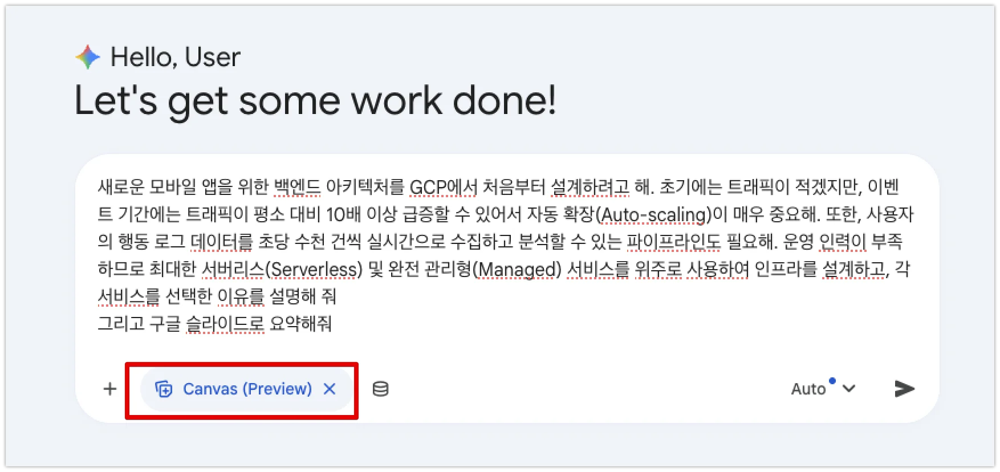 | 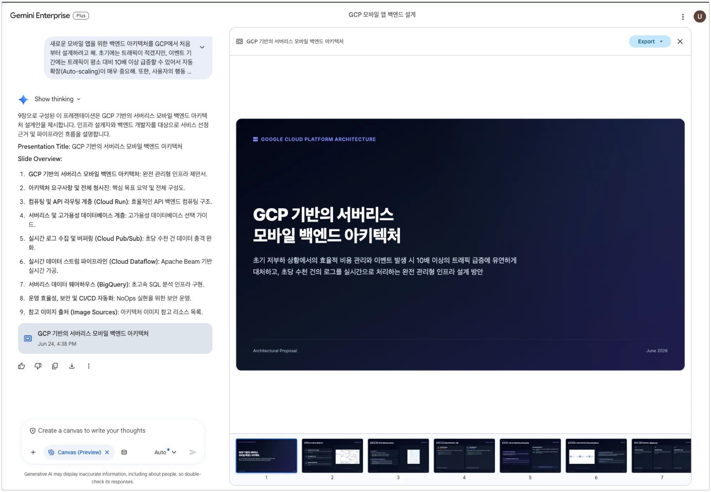 |

---

### 2) 실전 실습 2: 기술 문서 스타일 지정 슬라이드 제작

```markdown
위에서 작성한 GCP 백엔드 아키텍처 요약 슬라이드를, 하얀색 바탕의 깔끔하고 모던한 IT 기술 문서 스타일로 장표 레이아웃을 다시 구성해 줘.
```

| 기술문서 스타일 결과 1 | 기술문서 스타일 결과 2 |
| :---: | :---: |
|  |  |

---

## 1.8. 프롬프트 작성법

> [!TIP]
> ➕ **New chat (새 대화창 열기)**: 실습 시작 전 좌측 상단의 **New chat (새 대화창 열기)** 버튼을 눌러 이전 대화와 분리된 새 세션에서 진행하세요.

프롬프트의 완성도가 AI 출력물의 품질을 결정합니다. 실무 표준인 **C.R.A.F.T / 4대 요소 프레임워크**를 체계적으로 활용합니다.

### 1) 효과적인 프롬프트를 위한 4대 핵심 구성요소

| 요소 | 정의 및 역할 | 작성 예시 |
| :--- | :--- | :--- |
| **1. 페르소나 (Persona)** | AI에게 부여하는 전문적 직무, 연차, 정체성 | `"너는 15년 차 글로벌 이커머스 수석 마케팅 전략가야."` |
| **2. 컨텍스트 (Context)** | 배경 상황, 비즈니스 목적 및 참조 데이터 | `"다음 주 신규 PB 상품 런칭을 앞두고 예산 타당성 보고서를 작성 중이야."` |
| **3. 태스크 (Task)** | 명확한 동사로 지시하는 구체적 핵심 행동 과제 | `"경쟁사 동향을 비교하고 차별화 마케팅 액션 플랜을 도출해 줘."` |
| **4. 포맷 (Format)** | 최종 출력 구조, 표(Table), 분량 및 톤 제약 | `"경영진 보고용 개조식 보고서 양식으로 3개 파트로 나누어 작성해 줘."` |

---

### 2) 프롬프트 구조화 프레임워크 비교 (APE vs CRAFT vs CO-STAR)

| 프레임워크 | 핵심 구성 요소 | 추천 활용 업무 |
| :--- | :--- | :--- |
| **APE** | Action(행동) · Purpose(목적) · Expectation(기대결과) | 단순 요약, 빠른 팩트 질의, 짧은 발표 스크립트 작성 |
| **CRAFT** | Context(맥락) · Role(역할) · Action(행동) · Format(양식) · Tone/Target(어조/청중) | **정형화된 업무 보고서, 전략 기획안, 공식 이메일 (엔터프라이즈 표준)** |
| **CO-STAR** | Context · Objective · Style · Tone · Audience · Response | 마케팅 카피라이팅, B2B 제안서 등 정밀한 문체 통제가 필요한 작업 |

---

### 3) 범용 표준 템플릿 기반 4대 실무 확장 시나리오

현업에서 복사하여 즉시 활용할 수 있는 4대 실무 시나리오 프롬프트 세트입니다.

#### 시나리오 A. 신규 사업 제안서 기획 (옥상 가든 웰니스 라운지)

```markdown
[Context] 롯데백화점은 점포 경쟁력 강화 및 고객 체류 시간 확대를 위해 백화점 유휴 옥상 및 테라스 공간을 '친환경 웰니스 복합 라이프스타일 가든'으로 전환하는 신규 프로젝트를 추진 중입니다. 목적은 경영진에게 오프라인 공간 혁신과 ESG 경영 실천의 투자 타당성을 제안하는 것입니다.
[Role] 당신은 프리미엄 복합 문화 공간 및 리테일 공간 기획 분야에서 15년 경력을 보유한 롯데백화점 공간기획팀 수석 기획 전문가입니다.
[Action] 경영진 보고용 '백화점 유휴 옥상 공간의 친환경 웰니스 라이프스타일 가든 전환 기획서' 초안을 작성하세요. 고객 체험형 팝업, 친환경 조경, F&B 연계 아이디어가 포함되어야 합니다.
[Format] 1. 사업 개요 및 추진 필요성, 2. 공간 구성 및 단계별 오픈 일정, 3. 예상 방문객 증대 및 투자 대비 매출 효과 예측 모델(표), 4. 친환경 ESG 캠페인 연계 방안 순으로 작성하세요.
[Tone] 경영진 및 점포장 대상 보고이므로 집객 효과와 투자 수익성(ROI)에 초점을 둔 객관적이고 설득력 있는 문체를 유지하세요.
```

#### 시나리오 B. 고객 클레임 사과문 및 보상 안내

```markdown
[Context] 롯데백화점 봄 정기 세일 첫날 오전 10시부터 12시까지 2시간 동안 롯데백화점 모바일 앱 트래픽 폭주로 인해 '사은행사 모바일 상품권 다운로드 및 L.POINT(엘포인트) 적립/사용' 기능에 접속 지연 및 결제 오류가 발생하여 내점 고객 및 앱 이용 고객 불만이 다수 접수되었습니다.
[Role] 당신은 롯데백화점 고객경험(CX) 혁신 및 CS 커뮤니케이션을 12년간 총괄해 온 고객서비스실장입니다.
[Action] 롯데백화점 모바일 앱 회원 및 방문 고객들에게 공지/발송할 '공식 사과문 및 사은 쿠폰 재지급·보상 대책 안내문' 초안을 작성하세요.
[Format] 공지 제목 옵션 3개 / 도입부(상황 설명 및 원인) / 진심 어린 사과 문구 / 구체적 보상안(사은 상품권 유효기간 연장 및 특별 L.POINT 5,000P 지급 등) / 시스템 안정화 및 재발 방지 대책 순으로 작성하세요.
[Tone] 변명을 철저히 배제하고 고객의 불편에 깊이 공감하는 정중하고 신뢰감 있는 백화점 특유의 품격 있는 문체를 유지하세요.
```

#### 시나리오 C. 보도자료 분석 및 SWOT 전략

```markdown
[Context] 주요 경쟁 백화점이 초대형 '프리미엄 미식관(Food Hall) 리뉴얼 및 단독 글로벌 럭셔리 팝업스토어 오픈'을 발표하는 대대적인 보도자료를 배포했습니다. 롯데백화점 상품본부(MD) 및 마케팅팀이 취해야 할 대응 시나리오를 수립하는 것이 목적입니다.
[Role] 당신은 백화점 및 유통 산업에서 10년 이상 상품 기획(MD)과 경쟁사 분석(CI)을 담당해 온 롯데백화점 수석 마케팅 전략 애널리스트입니다.
[Action] 경쟁사 보도자료 및 리뉴얼 내용을 가상 분석하여 롯데백화점 MD/마케팅 조직이 참고할 SWOT 경쟁 대응 보고서를 작성하세요.
[Format] 1. 경쟁사 리뉴얼 핵심 사실 3줄 요약, 2. 경쟁사 전략 대비 롯데백화점 관점의 SWOT 매트릭스 표, 3. 롯데백화점의 F&B/명품 차별화 및 고객 락인(Lock-in) 대응 전략 2가지 제안.
[Tone] 주관적 추측을 배제하고 유통 트렌드와 고객 소비 데이터 관점에 기반한 객관적인 비즈니스 문체를 사용하세요.
```

#### 시나리오 D. IT 장애 포스트모템 보고서

```markdown
[Context] 주말 피크 시간대(일요일 14:00~16:30) 롯데백화점 전 점포 POS 및 모바일 결제 연동 시스템에서 데이터베이스 스토리지 임계치 초과(Full-Disk)로 인해 L.POINT 적립 및 결제 승인 API 트랜잭션 지연·중단 장애가 발생했습니다.
[Role] 당신은 대형 리테일 옴니채널 결제 시스템 분야에서 15년 이상의 시스템 운영 및 장애 대응을 총괄해 온 롯데백화점 IT/인프라팀 수석 시스템 엔지니어(Principal SRE)입니다.
[Action] 경영진 및 디지털혁신본부장에게 보고할 '점포 결제 및 L.POINT 연동 시스템 장애 사후 분석(Post-Mortem)' 보고서를 작성하세요.
[Format] 1. 장애 개요 및 점포 영향도 타임라인 표, 2. 근본 원인 분석(RCA), 3. 현장 긴급 조치 내역, 4. 스토리지 자동 확장(Auto-scaling) 및 결제망 이중화 재발 방지 대책.
[Tone] 간결하고 직관적인 개조식 엔터프라이즈 기술 보고서 문체를 사용하세요.
```

---

> **📖 Reference Source (원문 출처)**: 본 실습 가이드는 Google Cloud [https://geap.dev](https://geap.dev/)의 공식 교육 콘텐츠를 기반으로 비-GWS 엔터프라이즈 환경에 맞추어 재구성되었습니다.
