# 🔵 Track 2. Advanced — Agentic Value

> [!NOTE]
> **트랙 개요**: Gemini Notebook 팀 도서관 구축, Deep Research 자율 보고서, 에이전트 빌더를 활용한 맞춤형 AI로 업무 파이프라인을 직접 구성하는 중급 실습 과정입니다.

> [!TIP]
> **실습 첨부파일 다운로드**
> - [📦 설명서 실습용 이미지 패키지 (data_agent.zip)](samples/data_agent.zip)
> - [📦 시네마틱 슬라이드 실습용 이미지 (homestyle.zip)](samples/homestyle.zip)
> - [📄 Canvas 가이드 문서 (canvas.pdf)](samples/canvas.pdf)
> - [📦 Canvas 튜토리얼 비디오 패키지 (canvas.zip)](samples/canvas.zip)
> - [🌐 Track 2 인터랙티브 웹 포털 열기](https://geap.dev/track2.html)
> - [📽️ Track 2 16:9 발표 슬라이드 열기](https://geap.dev/slide_track2_v2.html)

---

## 2.1. Gemini Notebook Enterprise

업로드한 문서(PDF, 텍스트, 이미지) 범위 내에서 질의응답을 진행하고, Gemini Notebook으로 슬라이드, 인포그래픽, 튜토리얼 동영상을 자동 생성하는 실습입니다. 다음 5가지 과제를 순서대로 진행합니다.

Gemini Enterprise App 좌측 메뉴 **Agents > Gemini Notebook**에서 진입합니다.


| 실습 | Gemini Notebook 기능 | 내용 |
| :--- | :--- | :--- |
| **실습 1** | **Infographic** | AI 인포그래픽 3종 스타일 변환 (Overview, Sketchnote, Newspaper) |
| **실습 2** | **Audio Overview** | AI 팟캐스트 자동 생성 (AI 진행자 2인 대화) |
| **실습 3** | **Slide Deck** | 제품 이미지 소스 → 시네마틱 슬라이드 자동 완성 |
| **실습 4** | **Slide Deck + Reports** | BigQuery Data Agent 설명서 (Study Guide, FAQ, Briefing Doc) |
| **실습 5** | **Video Overview** | Canvas 기능 튜토리얼 동영상 자동 제작 |

---

### 🎨 실습 1: Infographic — AI 인포그래픽 생성

아래 3가지 Google 제품 소개 문서를 소스로 등록하고, **인포그래픽 3종**을 각각 다른 스타일로 만들어봅니다.

#### 1단계: 노트북 준비 및 소스 등록

1. **새 노트북 생성**: Gemini Enterprise App 좌측 메뉴 **Agents → Gemini Notebook**에서 **새로만들기**를 클릭합니다.
2. **소스 타입 선택**: 소스 추가 패널에서 **텍스트 붙여넣기**를 선택합니다.

   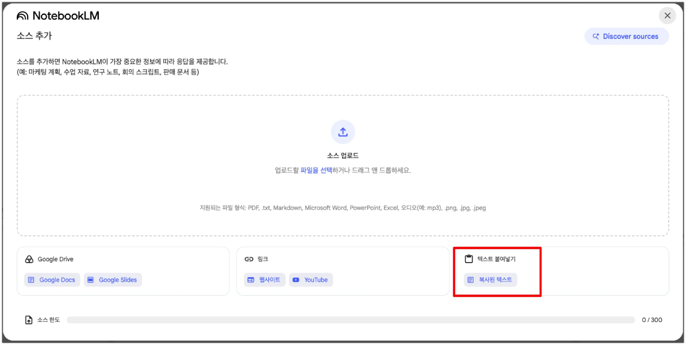

3. 아래 3가지 Google 제품 소개 문서를 **각각 개별 소스로 붙여넣기**합니다.

   

**[소스 A] Google Gemini**
```markdown
# Google Gemini — 기업용 AI 어시스턴트 및 전사 지식 플랫폼

Google Gemini는 텍스트, 코드, 고해상도 이미지, 오디오, 비디오를 동시에 이해하는 네이티브 멀티모달 대형 언어 모델입니다. 최대 200만 토큰에 달하는 긴 컨텍스트 윈도우를 지원하여 수백 페이지의 기술 문서, 사규집, 대규모 코드베이스를 한 번에 분석하고 핵심 인사이트를 도출합니다.

주요 기능으로 실시간 Google 검색과 연결된 웹 그라운딩(Web Grounding)과 수백 개 소스를 자율 탐색하는 Deep Research를 통해 최신 시장 동향 리포트를 자동 생성합니다. 또한 Cloud Storage(GCS) 및 M365(SharePoint/로컬 사내 문서) 커넥터를 통해 사내 문서와 내규를 권한(ACL) 기반으로 검색하여 정확한 출처와 함께 답변을 제공합니다.

보안 측면에서는 고객의 프롬프트와 사내 데이터가 모델 학습에 절대 사용되지 않습니다. 기업 전용 VPC 환경에서 데이터 주권을 완벽히 유지하며, Model Armor를 통해 개인정보(PII) 유출과 악성 프롬프트를 인라인으로 차단합니다. SOC 1/2/3, ISO/IEC 27001 등 국제 보안 표준 인증을 모두 충족합니다.

비즈니스 실무자를 위한 No-Code Agent Designer부터 개발자를 위한 Vertex AI API 및 ADK까지 폭넓게 제공하여, 단순 챗봇을 넘어 전사 업무를 자동화하는 커스텀 AI 에이전트 생태계를 구축할 수 있습니다.
```

**[소스 B] 엔터프라이즈 AI 업무 혁신 — 스마트 오피스 & 데이터 인텔리전스**

**[소스 C] Google Cloud**
```markdown
# Google Cloud — 엔터프라이즈 AI 혁신 및 인텔리전트 데이터 플랫폼

Google Cloud는 전 세계 40개 이상의 리전에서 확장성과 안정성을 보장하는 엔터프라이즈 인프라를 제공합니다. Google Kubernetes Engine(GKE)과 Cloud Run을 통해 컨테이너 기반 마이크로서비스와 AI 에이전트를 안정적으로 구동합니다.

Vertex AI는 기업용 생성형 AI 플랫폼입니다. Gemini 2.5를 비롯해 오픈소스 모델 등 150여 개 이상의 모델을 제공하는 Model Garden, 고정밀 사내 RAG 파이프라인, 그리고 오픈 에이전트 통신 규격인 A2A(Agent-to-Agent) 기반의 에이전트 빌더를 지원합니다. 커스텀 AI 가속기인 Cloud TPU v5e/v5p를 활용하여 대규모 AI 워크로드를 비용 효율적으로 운영합니다.

BigQuery는 페타바이트 규모의 데이터를 실시간 분석하는 서버리스 데이터 웨어하우스입니다. Conversational Analytics(CAA)를 통해 데이터 엔지니어가 아니더라도 자연어로 사내 원천 DB에 질의하여 정밀한 SQL 쿼리와 시각화 대시보드를 즉시 얻을 수 있습니다.

보안 체계는 Cloud Armor, Security Command Center, Chronicle SIEM으로 구성되어 다계층 위협 방어를 제공하며, VPC Service Controls(VPC-SC)를 통해 민감한 기업 데이터의 외부 유출 경로를 원천 차단합니다.
```

| 3개 소스 추가 완료 | 기본 질의응답 인터페이스 |
| :---: | :---: |
| 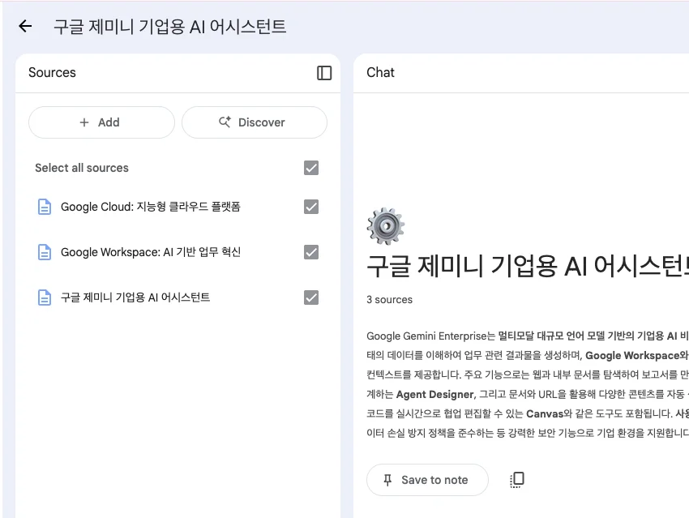 | 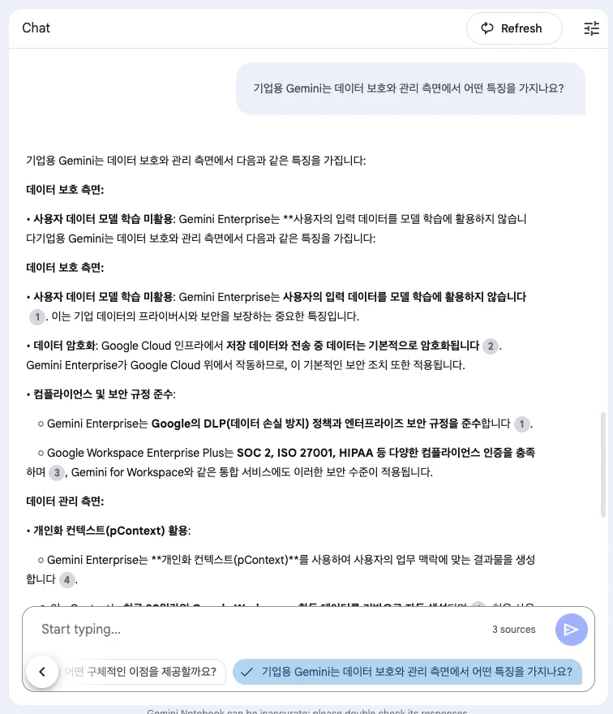 |

---

#### 2단계: 3종 스타일 인포그래픽 생성

1. **기본 인포그래픽 (Overview)**: 우측 Infographic 버튼의 점 세 개 메뉴를 클릭하고 프롬프트를 실행합니다.

   

   ```markdown
   엔터프라이즈 AI 업무 혁신 플랫폼의 핵심 모듈과 비즈니스 기대 효과를 한눈에 정리한 인포그래픽을 만들어줘
   ```

   | 프롬프트 입력 | 생성 결과 |
   | :---: | :---: |
   | 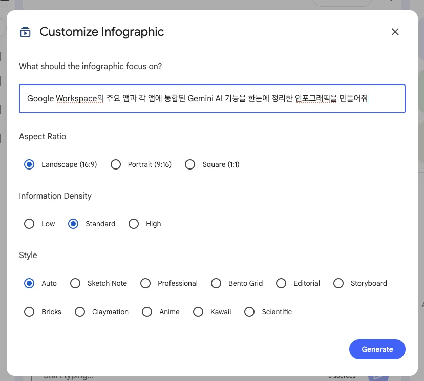 |  |

   > [!TIP]
   > **화면 비율 안내**: 인포그래픽이 세로로 길게 보일 수 있습니다. **다운로드** 버튼으로 저장하면 16:9 가로 비율로 정상 출력됩니다.

2. **스케치노트 스타일 (Sketchnote)**: 동일한 생성 버튼을 눌러 다른 프롬프트를 입력합니다.

   ```markdown
   Google Gemini Enterprise의 핵심 기능과 실무 활용 시나리오를 스케치노트 스타일로 그려줘
   ```

   | 프롬프트 입력 | 스케치노트 스타일 결과 |
   | :---: | :---: |
   |  | 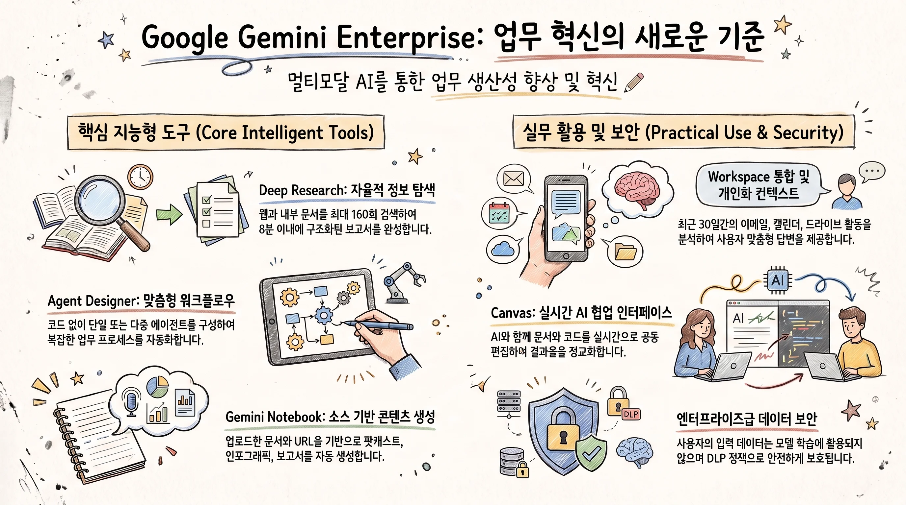 |

3. **신문 1면 스타일 (Newspaper Front-page)**: 퍼블리싱 톤의 결과물을 생성합니다.

   ```markdown
   Google Cloud Vertex AI와 BigQuery 기반 기업 AI 혁신 현황을 신문 1면 기사 스타일 인포그래픽으로 만들어줘
   ```

   | 프롬프트 입력 | 신문 1면 스타일 결과 |
   | :---: | :---: |
   |  | 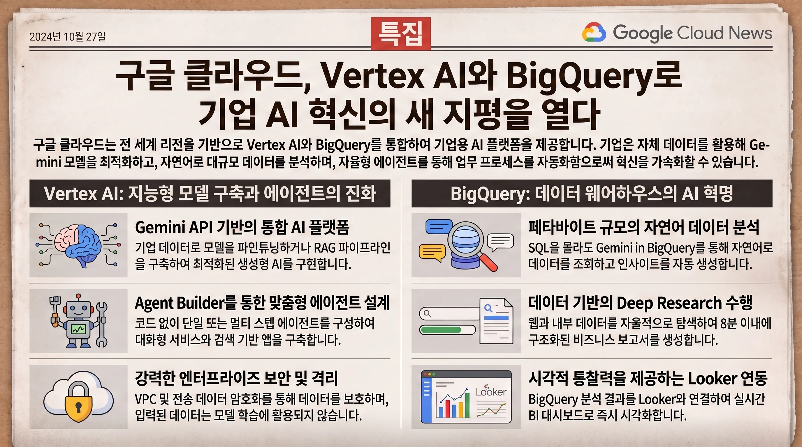 |

---

### 🎙️ 실습 2: Audio Overview — AI 팟캐스트 자동 생성

동일 노트북 우측 **오디오 개요** 패널에서 **생성하기**를 클릭하면, AI 진행자 2인이 소스 문서 전체를 요약해 **5~8분 분량의 팟캐스트 오디오**를 자동 완성합니다.

| 오디오 패널 | 오디오 생성 결과 |
| :---: | :---: |
|  | 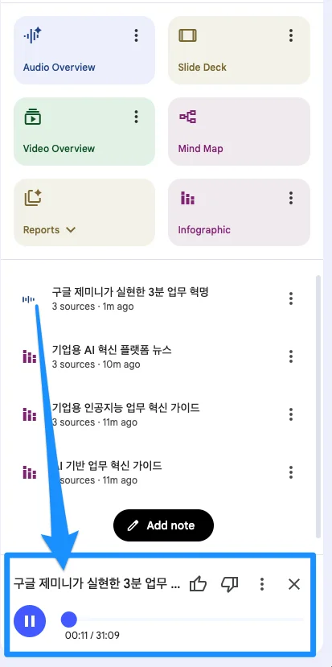 |

> [!TIP]
> 팀 내 공유용으로 사용하거나, 이동 중 이어폰으로 문서 내용을 파악할 때 유용합니다. 생성된 오디오는 다운로드 후 사내 메신저나 이메일로 바로 배포할 수 있습니다.

---

### 🎬 실습 3: Slide Deck — 시네마틱 슬라이드 생성

> [!TIP]
> ➕ **새 노트북(create new) 열기**: 실습 시작 전 **새 노트북(create new)을 엽니다**. 이전 실습 소스와 분리하여 homestyle 전용 새 노트북을 생성하여 진행합니다.

제품 이미지만으로 Gemini Notebook이 영화 같은 시네마틱 슬라이드를 자동 생성합니다. 라이프스타일 브랜드 '홈스타일'의 신제품 이미지를 소스로 업로드하고, 브랜드 스토리를 붙여 시네마틱 슬라이드를 만듭니다.

#### 1단계: 실습 파일 준비
- [📥 homestyle.zip 받기](samples/homestyle.zip)
- 압축을 해제하면 `sofa.png`, `cushion.png`, `lighting.png`, `diffuser.png` 4장의 제품 이미지가 나옵니다.

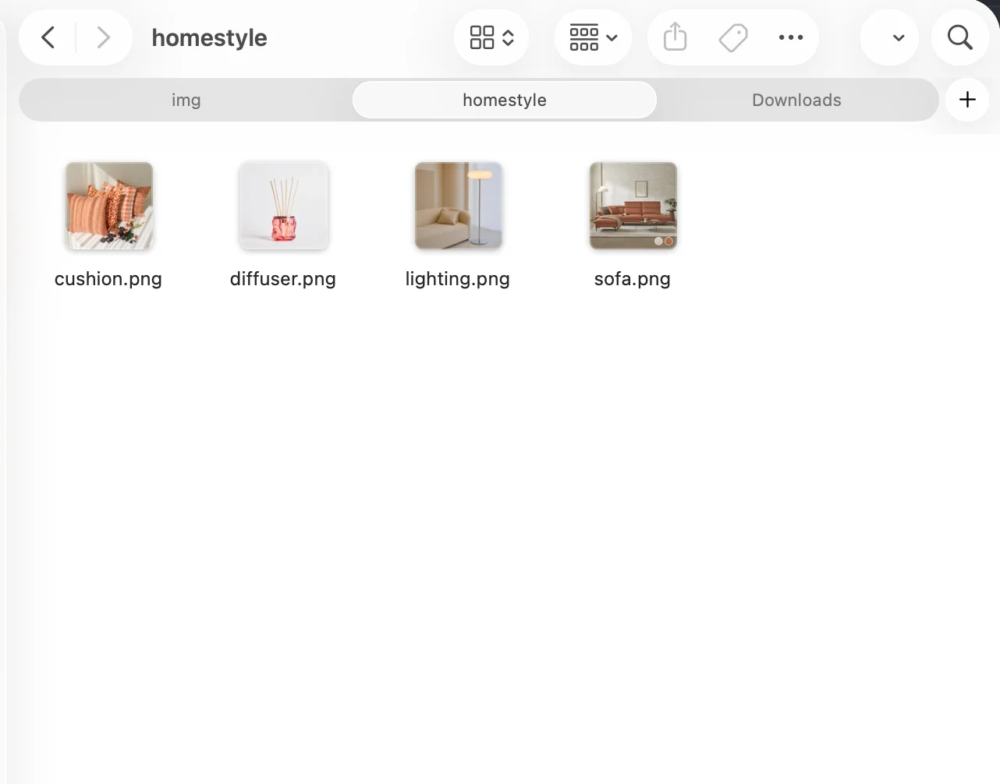

#### 2단계: 새 노트북 생성 및 이미지 업로드
1. Gemini Enterprise App 좌측 메뉴 **Agents → Gemini Notebook**에서 **새로만들기**를 클릭합니다.
2. **소스 추가 → 파일 업로드**를 선택하고 이미지 4장을 한꺼번에 업로드합니다.


#### 3단계: 브랜드 스토리 텍스트 추가
**소스 추가 → 텍스트 붙여넣기**를 선택하고, 아래 텍스트를 복사해 붙여넣은 뒤 소스 이름을 **story**로 저장합니다.

```markdown
### **스토리**

**Scene 1. 햇살이 가득한 주말 오후**
* **배경:** 따뜻한 햇살이 큰 창을 통해 가득 들어오는, 밝고 화사한 톤의 모던한 거실.
* **오브젝트 배치:** 거실 중심에 브라운 가죽 소파인 sofa.png가 놓여 있고, 그 위로 창밖의 햇살이 부드럽게 내리쥡니다. 소파 위에는 화사한 오렌지색 기하학 패턴의 cushion.png들이 자연스럽게 놓여 있습니다. 소파 옆으로는 은은한 반투명 전등갓의 플로어 램프 lighting.png가 서 있고, 소파 앞 작은 테이블 위에는 영롱하게 빛나는 핑크색 디퓨저 diffuser.png가 놓여 있습니다.
* **스토리:** 주말 오후, 상쾌한 기분으로 주인공이 거실로 들어와 햇살을 받으며 소파 쪽으로 천천히 걸어갑니다.

**Scene 2. 포근한 소파에서의 시작 (sofa.png)**
* **배경:** 햇살이 가득 찬 화사한 거실.
* **오브젝트 배치:** 주인공이 햇살을 가득 머금은 sofa.png 브라운 가죽 소파에 몸을 포근하게 맡깁니다. 소파의 넓고 유연한 가죽 질감이 소파를 중심으로 거실 공간 전체와 자연스럽게 어우러져 화면에 담깁니다.
* **스토리:** 주인공이 소파에 기대어 편안한 표정으로 숨을 고릅니다. 소파는 거실의 중심에서 가장 따뜻하고 포근한 안식처의 역할을 합니다.

**Scene 3. 경쾌한 포인트 쿠션 (cushion.png)**
* **배경:** 소파에 앉아 편안히 휴식을 취하는 주인공의 모습.
* **오브젝트 배치:** 주인공이 포근한 소파 위에서 오렌지색 기하학 패턴의 cushion.png 쿠션을 가볍게 끌어안거나 기대고 있습니다.
* **스토리:** 주인공이 자연스럽게 옆에 있던 오렌지색 쿠션 하나를 품에 끌어안습니다. 선명한 패턴과 색감이 거실 분위기를 한층 더 감각적이고 상쾌하게 변화시킵니다.

**Scene 4. 공간을 채우는 부드러운 빛 (lighting.png)**
* **배경:** 턴을 넘기듯 자연스럽게 이어지는 거실 공간.
* **오브젝트 배치:** 주인공이 소파에 앉은 채로 손을 뻗어, 소파 옆에 자연스럽게 배치된 lighting.png 플로어 램프를 켭니다. 은은하고 부드러운 유백색 빛이 자연 채광과 섞여 거실 전체를 한층 더 아늑하게 감싸 안습니다.
* **스토리:** 조명의 따스한 불빛이 들어오면서 공간의 입체감이 살아나고, 거실 전체 인테리어가 더욱 세련되고 완성도 높게 연출됩니다.

**Scene 5. 감각을 깨우는 상쾌한 향기 (diffuser.png)**
* **배경:** 소파 앞 테이블과 거실 전체가 흐릿하게(아웃포커싱) 잡히는 구도.
* **오브젝트 배치:** 카메라 시선이 소파 앞 테이블 위에 놓인 diffuser.png 핑크색 디퓨저를 향합니다. 디퓨저는 햇살과 램프 빛을 동시에 받아 영롱하게 반짝이며 공간의 오브젝트들과 완벽한 톤앤매너를 이룹니다.
* **스토리:** 공기 중으로 디퓨저의 상쾌한 향이 은은하게 퍼지는 듯한 연출과 함께, 쿠션을 안고 소파에 기댄 주인공이 편안하게 눈을 감으며 주말의 완벽한 휴식을 만끽합니다.

**Scene 6. 완벽한 휴식의 공간 (엔딩)**
* **배경:** 모든 아이템이 조화롭게 어우러진 전체 거실 전경.
* **오브젝트 배치:** 카메라가 천천히 뒤로 물러나며(줌아웃), sofa.png 소파 위에 cushion.png 쿠션을 안고 햇살을 받으며 누운 주인공, 그 옆을 따뜻하게 비추는 lighting.png 램프와 상쾌한 무드를 더하는 diffuser.png까지 완벽하게 어우러진 화사한 거실의 전체 인테리어를 잡습니다.
* **스토리:** 잘 정돈된 아름다운 공간 속에서 오감으로 완성된 나만의 안식처를 보여주며 상쾌하게 마무리됩니다.
```

| 텍스트 소스 입력 | 소스 5개 등록 완료 |
| :---: | :---: |
| 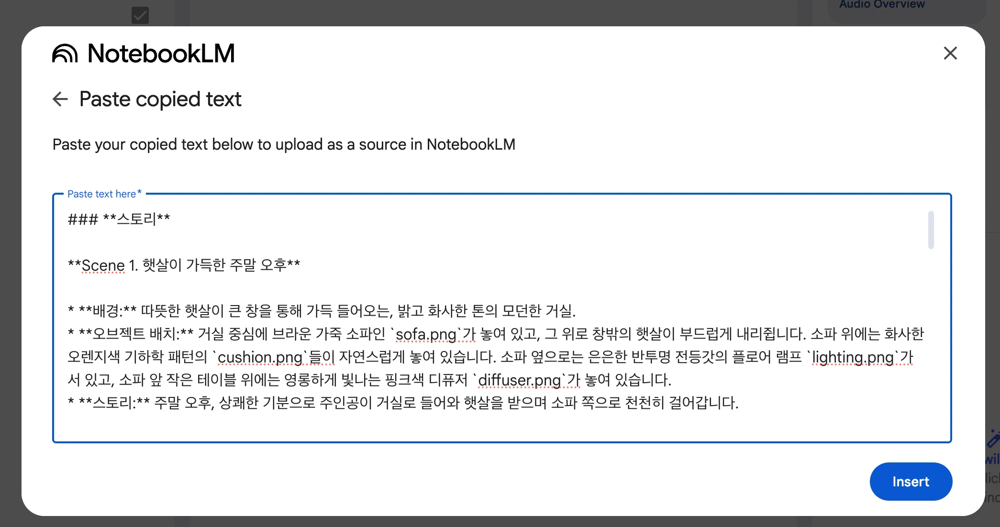 |  |

#### 4단계: 시네마틱 슬라이드 생성 및 다운로드

노트북 우측 **슬라이드 자료** 패널에서 customize 옵션을 선택하고 프롬프트를 실행합니다.

```markdown
스토리에 맞는 시네마틱 슬라이드를 만들어줘, 타이틀, 텍스트, 자막, 설명 등은 포함하지 마
```

| 슬라이드 패널 | 프롬프트 입력 |
| :---: | :---: |
|  | 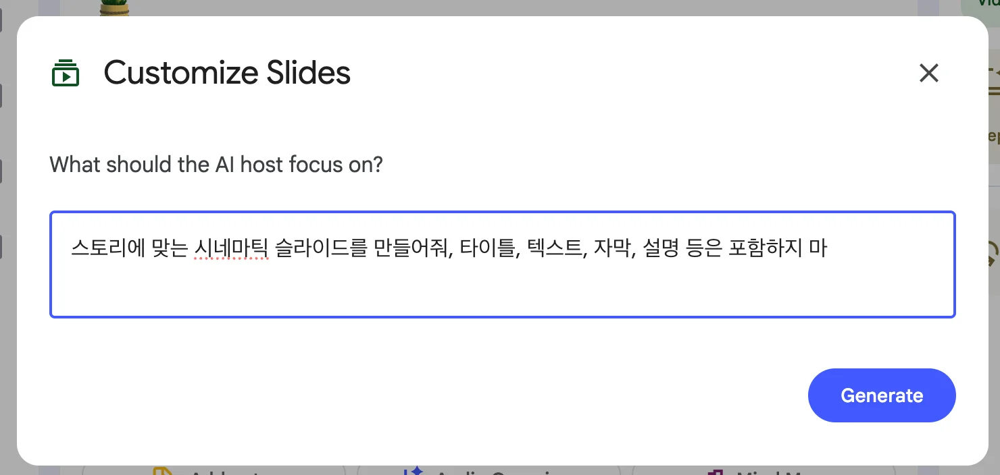 |

| 생성 진행 중 | 슬라이드 완성 화면 |
| :---: | :---: |
|  | 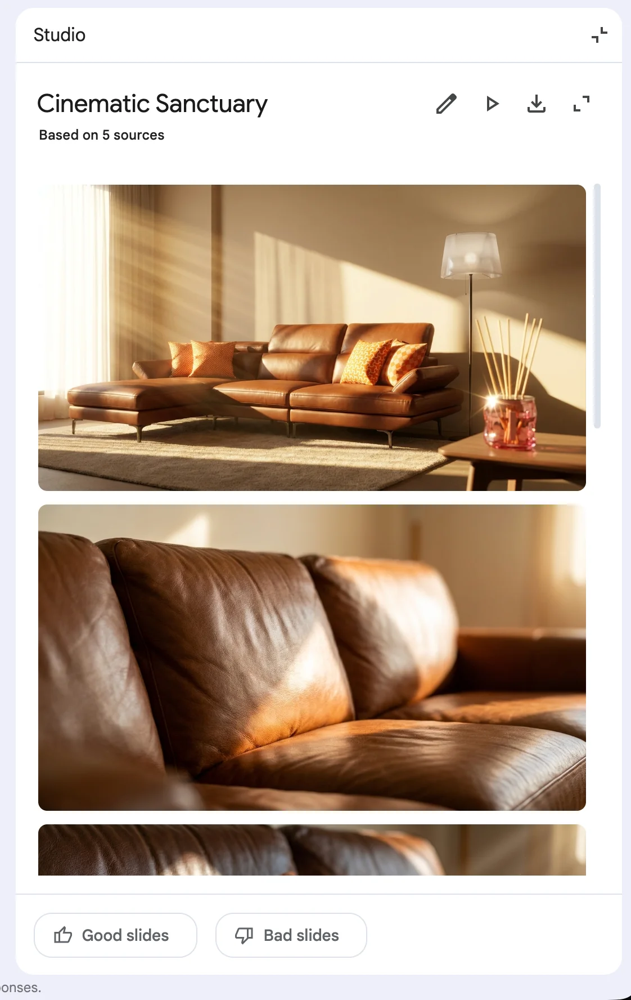 |

| 다운로드 옵션 선택 | PPTX 다운로드 |
| :---: | :---: |
| 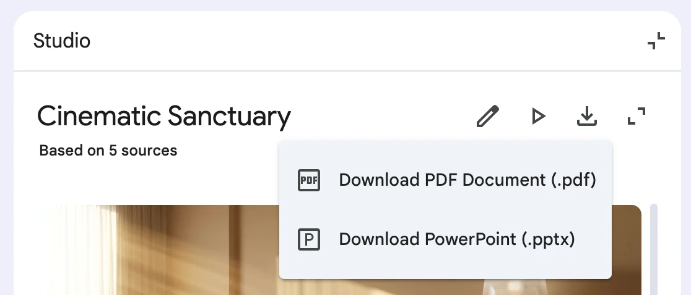 |  |

- [📊 완성된 슬라이드 PPTX 다운로드 (Cinematic Sanctuary.pptx)](samples/Cinematic%20Sanctuary.pptx)
- [📄 완성된 슬라이드 PDF 다운로드 (Cinematic Sanctuary.pdf)](samples/Cinematic%20Sanctuary.pdf)

---

### 📖 실습 4: Slide Deck + Reports — 설명서 만들기

> [!TIP]
> ➕ **새 노트북(create new) 열기**: 실습 시작 전 **새 노트북(create new)을 엽니다**. 이전 실습 소스와 분리하여 data_agent 전용 새 노트북을 생성하여 진행합니다.

새로운 노트북을 생성하고 `data_agent.zip`의 이미지 10개를 소스로 업로드합니다. **슬라이드 Customize**로 가이드 문서를 생성하고, Studio의 **Reports** 기능으로 스터디 가이드, FAQ, 브리핑 문서를 제작합니다.

1. **소스 업로드**: `data_agent.zip` 압축 해제 후 이미지 10개를 소스에 추가합니다.

   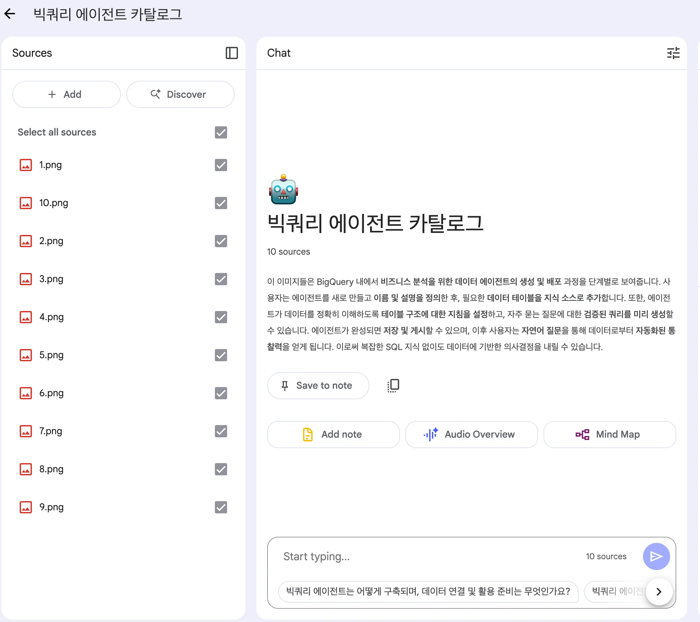

2. **슬라이드 가이드 생성**: 슬라이드 Customize 버튼을 클릭하고 아래 프롬프트를 실행합니다.
   ```markdown
   BigQuery Data Agent를 생성하는 과정을 초보자도 쉽게 따라할 수 있도록 가이드 문서를 작성해줘
   ```

   | 프롬프트 입력 | 가이드 슬라이드 결과 |
   | :---: | :---: |
   | 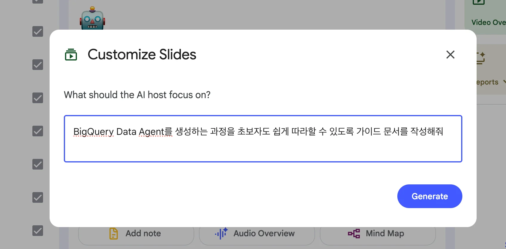 |  |

3. **3대 보고서 자동 생성 (Reports)**:

   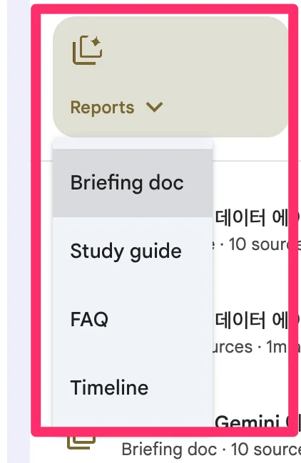

   | 스터디 가이드 (Study Guide) | FAQ (자주 묻는 질문) | 브리핑 문서 (Briefing Doc) |
   | :---: | :---: | :---: |
   | 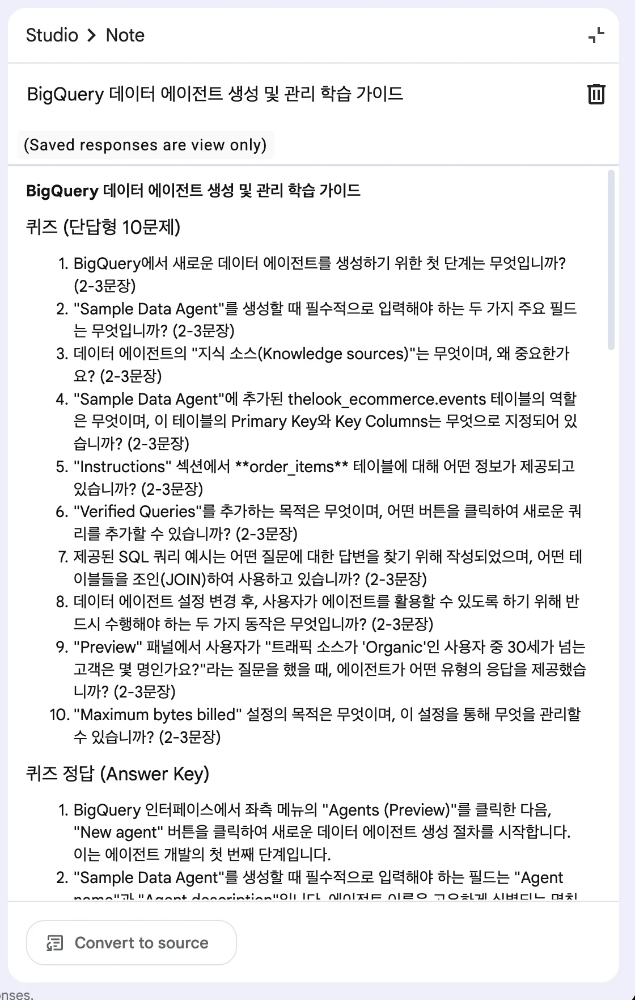 |  | 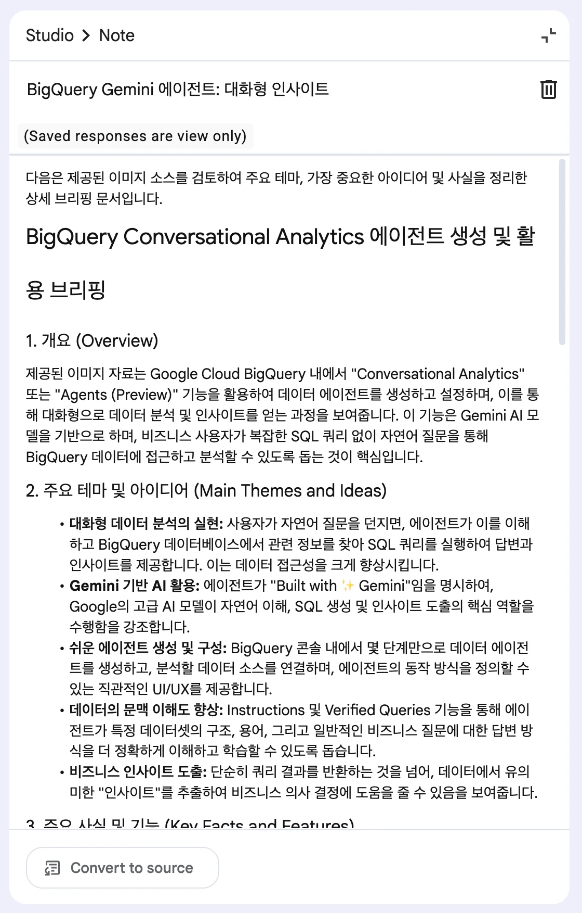 |

---

### 🎬 실습 5: Video Overview — Canvas 튜토리얼 동영상 제작

> [!TIP]
> ➕ **새 노트북(create new) 열기**: 실습 시작 전 **새 노트북(create new)을 엽니다**. 이전 실습 소스와 분리하여 canvas 전용 새 노트북을 생성하여 진행합니다.

PDF 문서와 UI 스크린샷 이미지를 소스로 업로드하여 Canvas 사용법을 설명하는 튜토리얼 동영상을 자동 생성합니다.

#### 1단계: 실습 파일 준비
- [📄 Canvas 가이드 문서 (canvas.pdf)](samples/canvas.pdf)
- [📦 Canvas UI 스크린샷 이미지 모음 (canvas.zip)](samples/canvas.zip)

#### 2단계: 소스 업로드 및 비디오 생성
1. Gemini Notebook에서 `canvas.pdf`와 `canvas.zip` 내 스크린샷 이미지들을 한꺼번에 업로드합니다.

   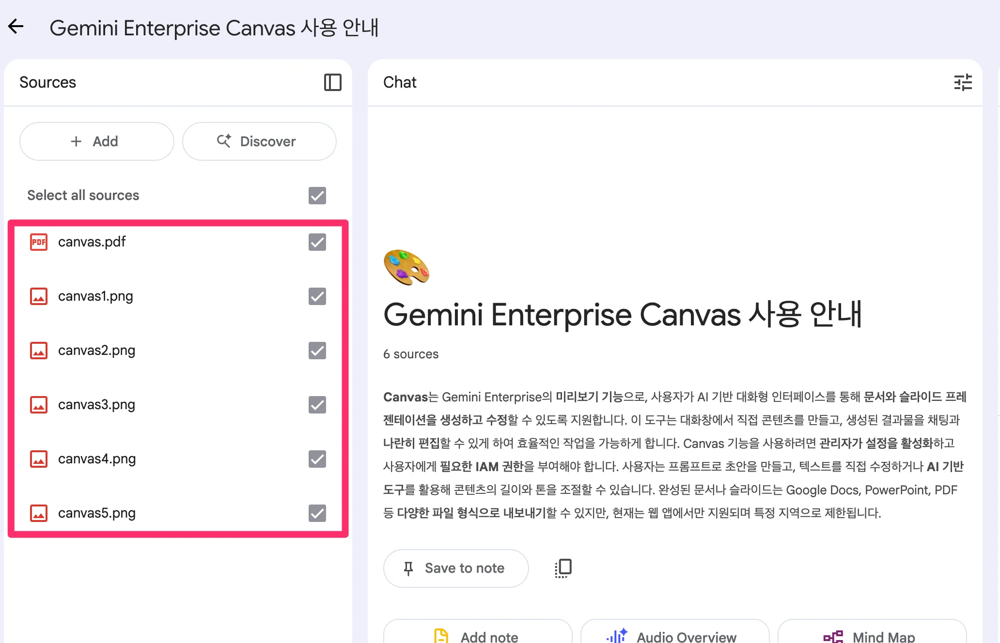

2. Video Overview의 **Customize** 버튼을 클릭하고 아래 프롬프트를 실행합니다.
   ```markdown
   Gemini Enterprise에서 Canvas를 사용하는 방법을 초보자도 따라가기 쉽게 차근차근 설명하는 동영상을 만들어줘
   ```

   | 영상 커스터마이즈 | 프롬프트 입력 |
   | :---: | :---: |
   | 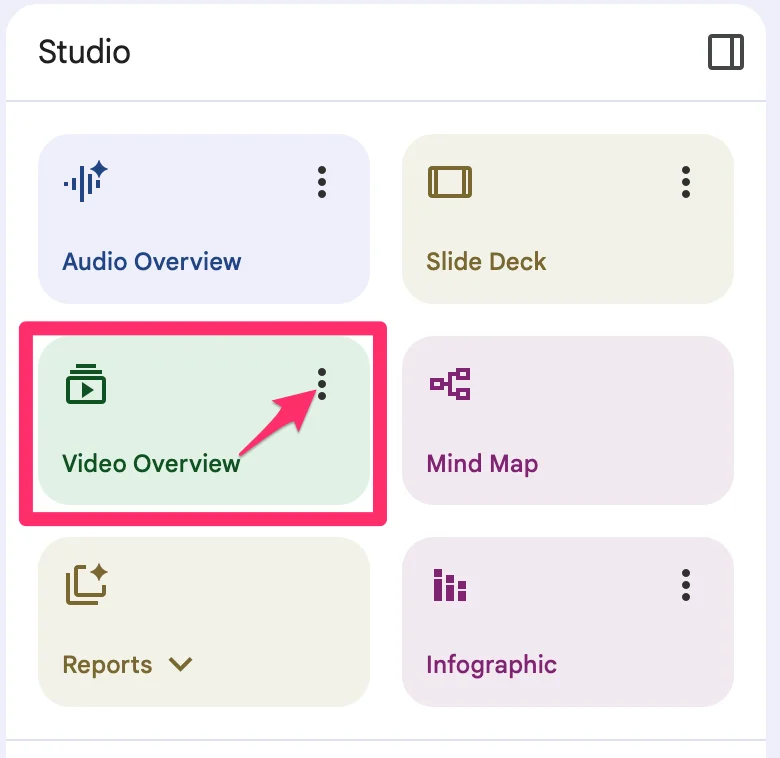 |  |

3. 완성된 튜토리얼 동영상을 확인합니다.

   | 씬 1 | 씬 2 | 씬 3 |
   | :---: | :---: | :---: |
   | 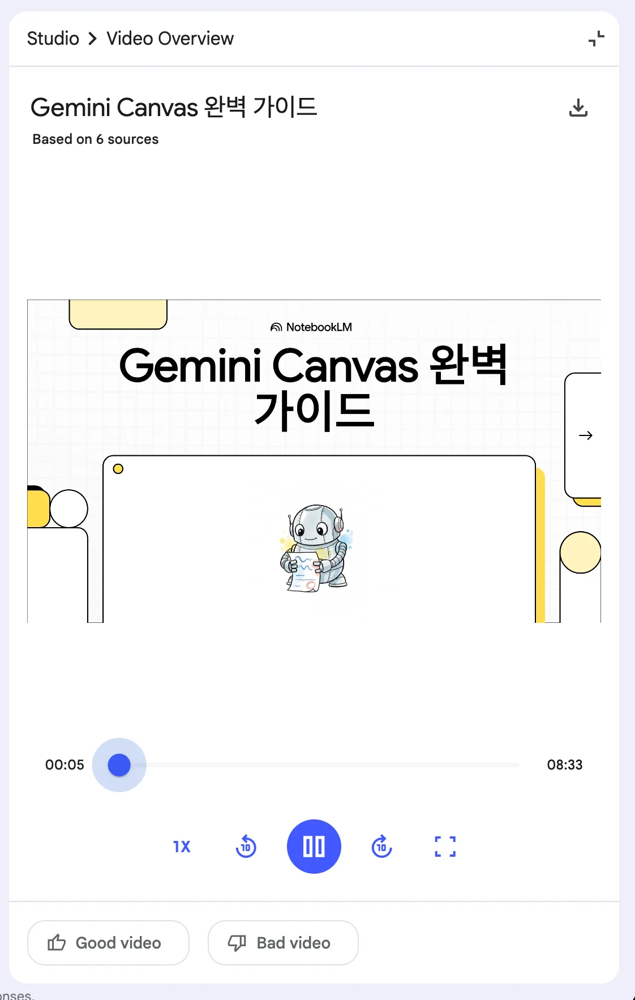 |  | 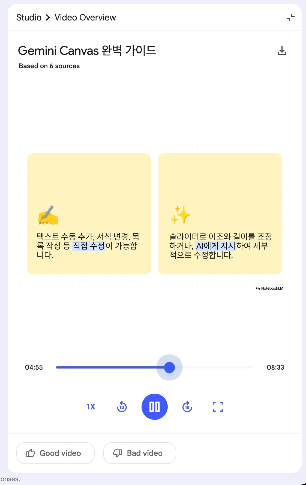 |

---

## 2.2. Deep Research Agent

복잡한 연구 주제를 하위 질문으로 분해하고, 웹과 기업 내부 문서를 다단계로 자율 탐색해 인용 출처가 명시된 종합 보고서를 만드는 에이전트입니다.

| 항목 | 내용 |
| :--- | :--- |
| **검색 횟수** | 표준 약 80회, Deep Research Max 최대 160회 |
| **소요 시간** | 일반적으로 3~8분 |
| **소스** | 웹, 사내 스토리지(GCS/SharePoint), 로컬 첨부 문서 |
| **출력물** | 목차 및 인용 링크 포함 마스터 보고서 + 오디오 브리핑 요약 |

1. **에이전트 실행**: 좌측 메뉴에서 **Deep Research**를 클릭하고 프롬프트를 실행합니다.

   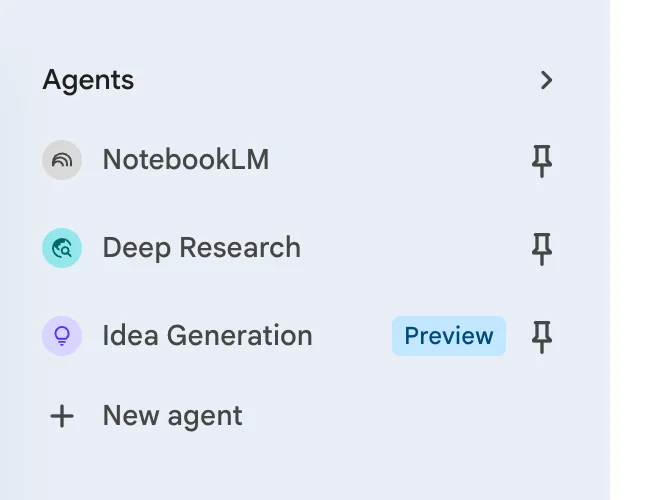

   ```markdown
   현재 글로벌 프리미엄 백화점 및 오프라인 리테일 산업의 최신 공간 혁신 트렌드와 피지컬 AI/리테일 테크 동향을 종합적으로 분석해 줘. 롯데백화점이 속한 국내외 백화점 산업의 핵심 경쟁 우위 요소를 도출하고 향후 직면할 기회와 위협 요인 및 신성장 동력을 논리적으로 설명해 줘
   ```

2. **완성 보고서 검토**:

   | Deep Research 프롬프트 입력 | 리서치 계획(Research plan) 수립 |
   | :---: | :---: |
   | 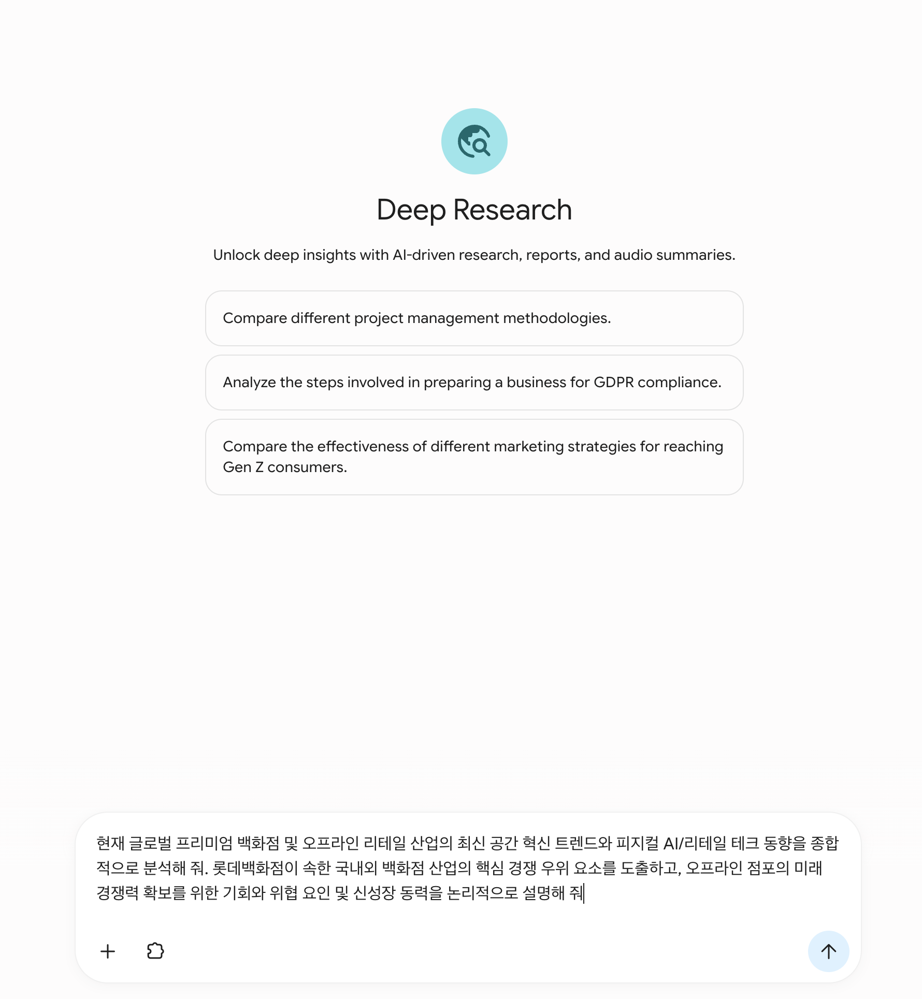 | 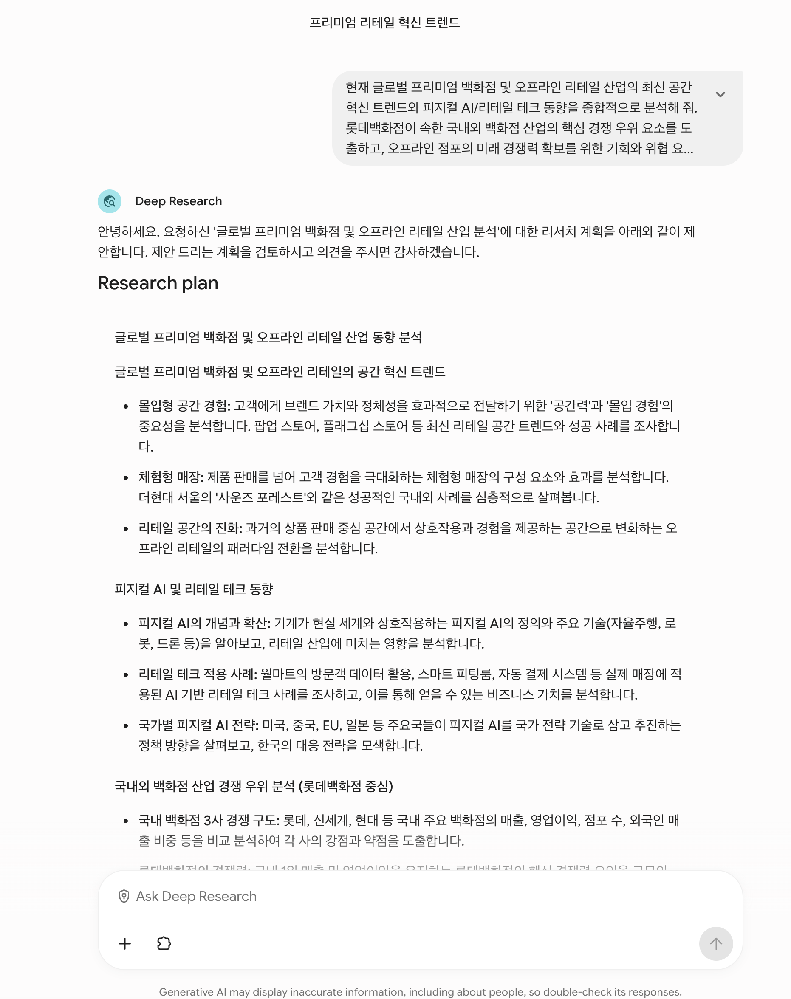 |

---

## 2.3. Agent Designer

코드 없이 클릭 몇 번으로 업무에 특화된 AI 에이전트를 직접 만들고 팀원들과 공유합니다.

### 1) 에이전트 종류와 실무 활용 예시

- **No-Code 에이전트**: Agent Designer에서 자연어로 규칙과 대상을 설계하는 임직원용 간편 에이전트.
- **Low-Code 에이전트**: 시각적인 노드 기반 흐름 빌더(Flow Builder)와 트리거, 승인 단계 레이아웃을 통해 제작하는 업무 에이전트.
- **High-Code 에이전트**: 개발자 전용 프레임워크인 ADK(Agent Development Kit)를 사용해 Python 코드로 백엔드 API와 레거시 시스템 트랜잭션을 연동하는 고급 에이전트.


---

### 2) 실전 실습: CRAFT 프롬프트 에이전트 만들기

1. **New Agent**를 클릭하고 Chat Pane에 아래 설계 요구 명세를 입력합니다.

   | Agents 메뉴 진입 | New Agent 클릭 |
   | :---: | :---: |
   |  | 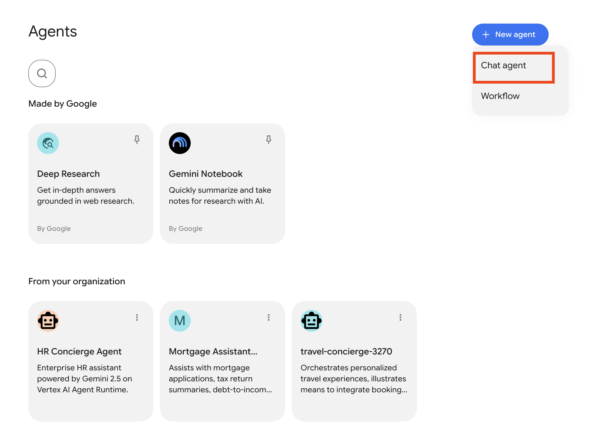 |

   ```markdown
   사용자가 작성한 프롬프트를 Gemini에 사용하기 좋도록 아래 CRAFT 프레임워크 기반으로 프롬프트를 재작성합니다. 작성하기 위해 너(Gemini)에게 어떤 정보가 필요한지 나에게 질문하여 얻습니다.

   ### [CRAFT 프레임워크]
   - Context (맥락): 상황을 파악할 수 있도록 배경지식, 목적, 비즈니스 환경을 제공합니다.
   - Role (역할): 구체적인 직업, 연차, 정체성을 부여하여 전문적인 페르소나를 활성화합니다.
   - Action (행동): 수행해야 할 핵심 작업이나 미션을 명확한 동사로 지시합니다.
   - Format (출력 형식): 보고서, 이메일, 표, 불릿포인트 등 원하는 결과물의 구조를 지정합니다.
   - Tone / Target (타겟 및 어조): 답변의 최종 소비자를 정의하고 전문적, 친근함 등의 톤앤매너를 설정합니다.
   ```

2. **Flow Builder 확인 및 Preview 테스트**:

   | 명세 입력 | Flow Builder 편집 |
   | :---: | :---: |
   |  |  |

   | Preview 테스트 | Create 배포 |
   | :---: | :---: |
   | 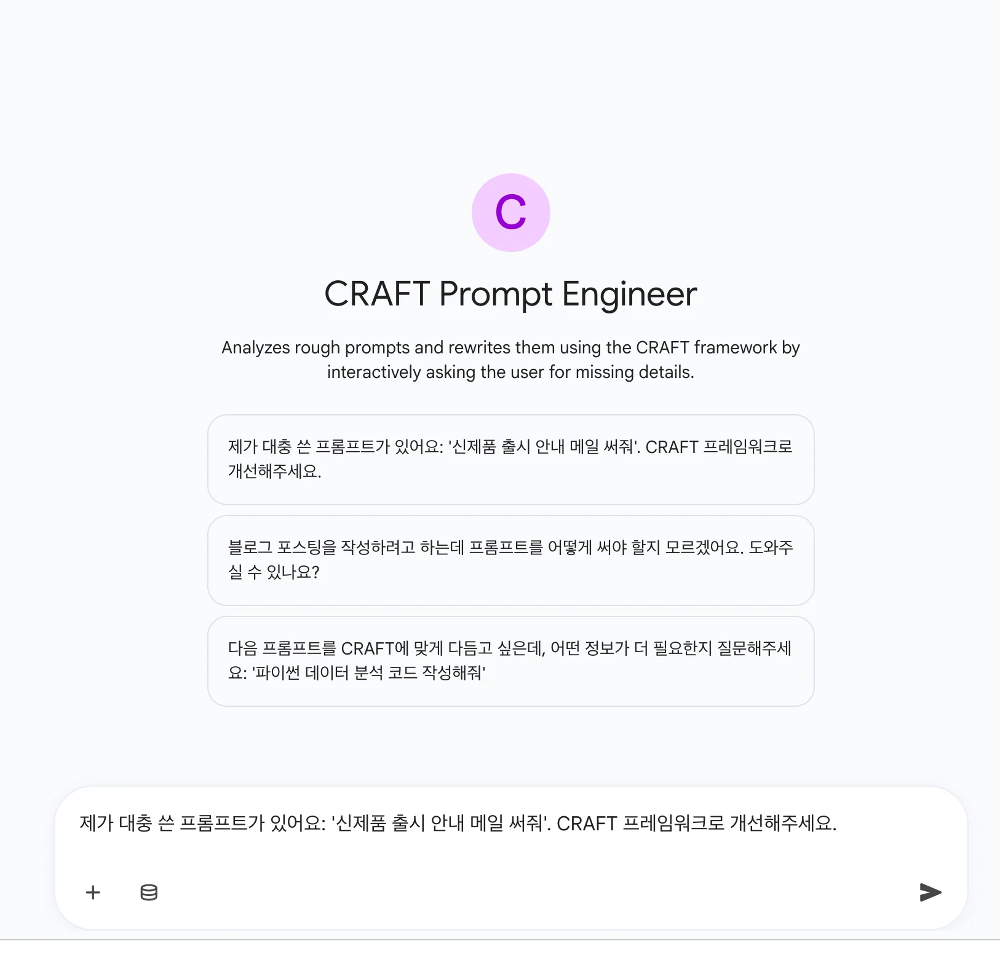 | 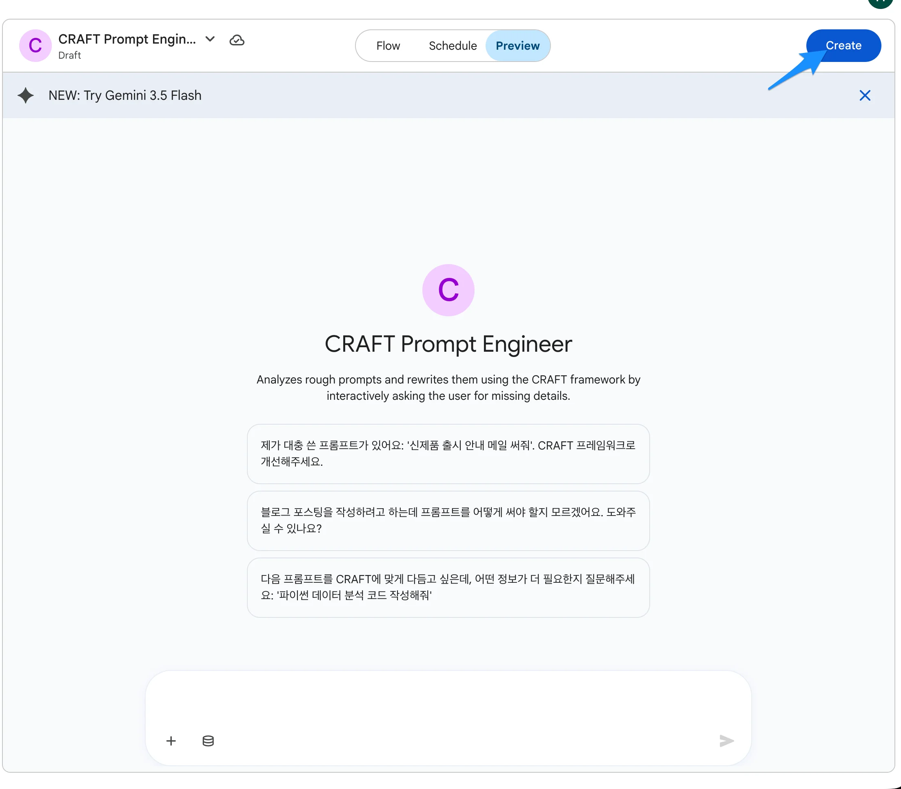 |

   | 배포 후 옵션 | 배포된 에이전트 채팅 |
   | :---: | :---: |
   | 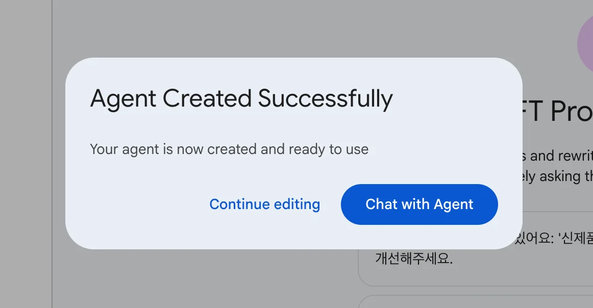 |  |

3. 생성된 에이전트는 **Your Agents** 목록에서 확인할 수 있습니다.

   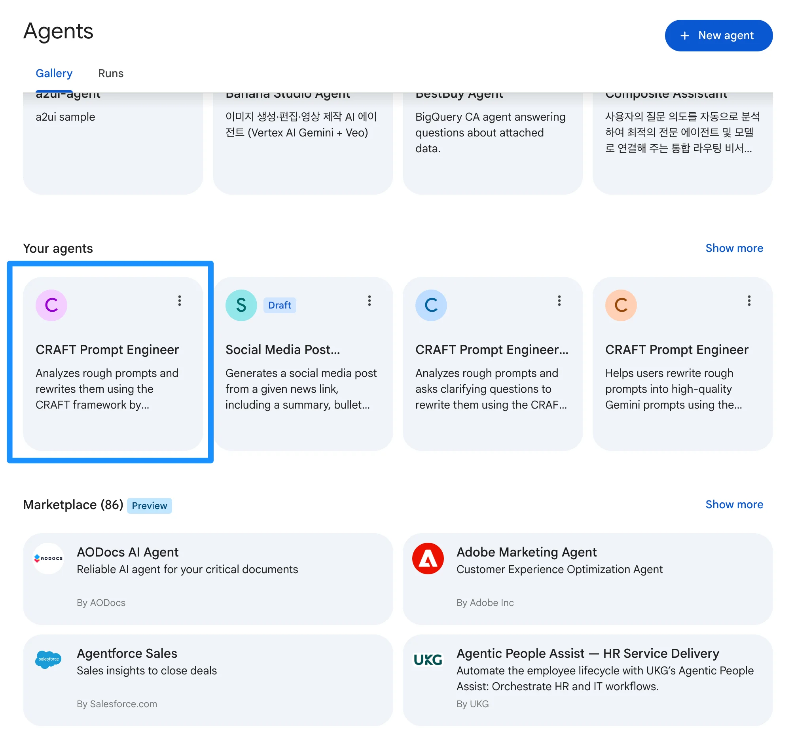

---

### 3) 실전 실습: 뉴스 링크 기반 SNS 마케팅 포스팅 자동 빌더

1. 에이전트 디자이너 왼쪽 대화창에 아래 프롬프트를 입력합니다.
   ```markdown
   뉴스 링크를 입력 받아서 Social Media 포스팅할 게시물 문구를 생성하는 에이전트를 만들어줘. 포스팅할 문구는 간략한 한줄 문장과 bullet point 5개를 생성하고 Hashtag도 추천해줘.
   ```

   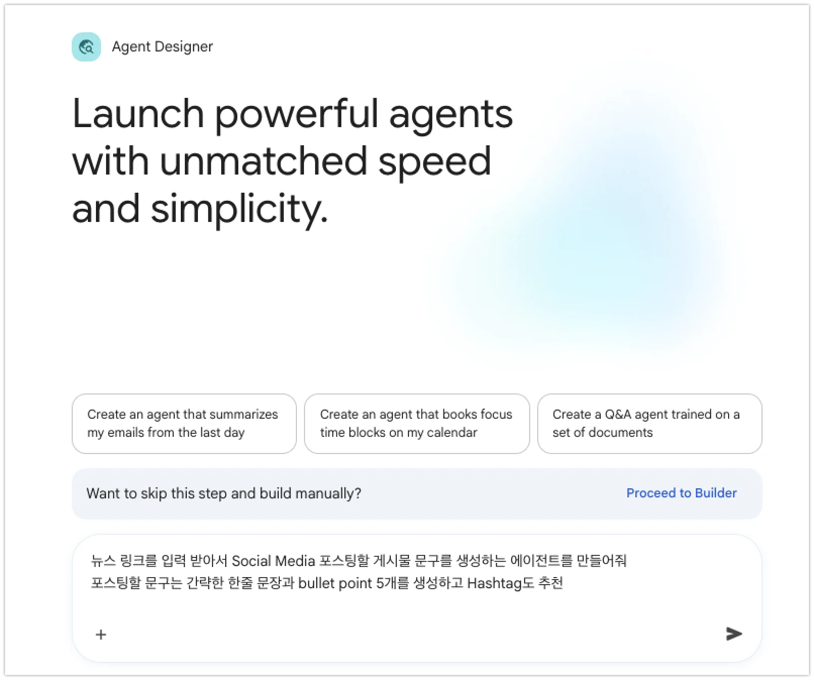

2. 우측 Flow를 검토한 뒤 **Create** 버튼을 클릭하여 적용합니다.

   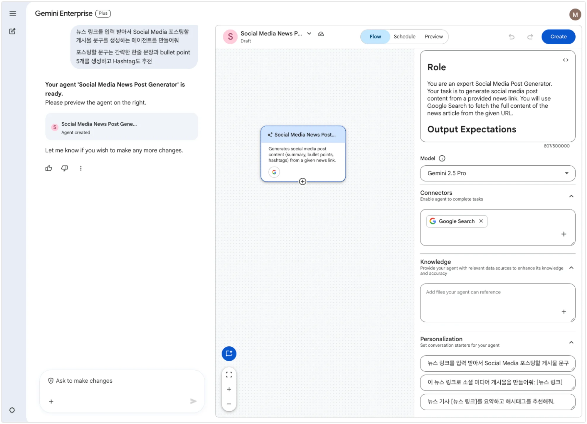

3. 프리뷰 테스트 창에 뉴스 기사 링크를 붙여넣어 결과를 테스트합니다.
   ```markdown
   이 뉴스 링크로 소셜 미디어 게시물을 만들어줘: https://www.sidae.com/article/2026090410205240078
   ```

   | 프리뷰 테스트 | 출력 화면 |
   | :---: | :---: |
   | 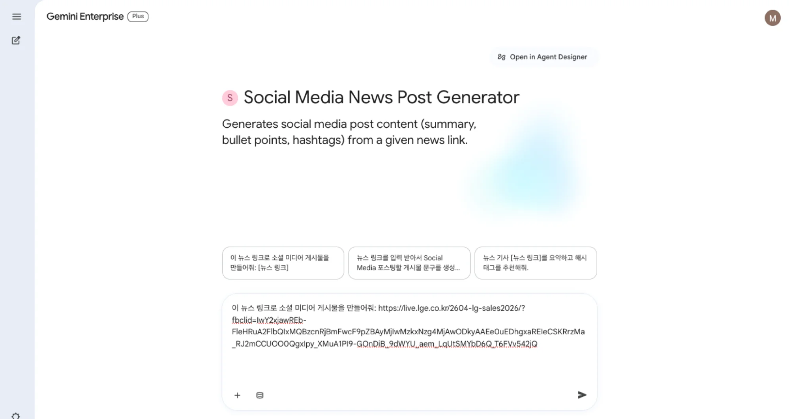 | 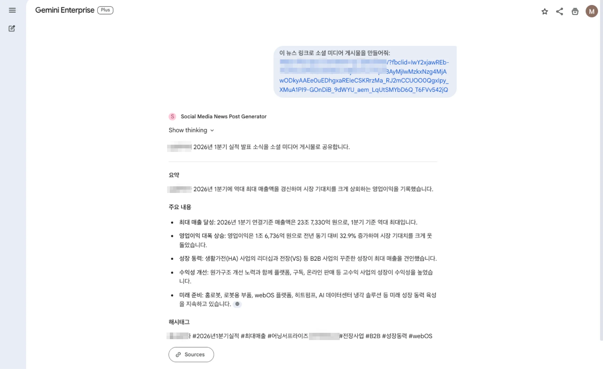 |

4. **Agent Gallery**에 발행하여 사내 구성원들과 공유합니다.

   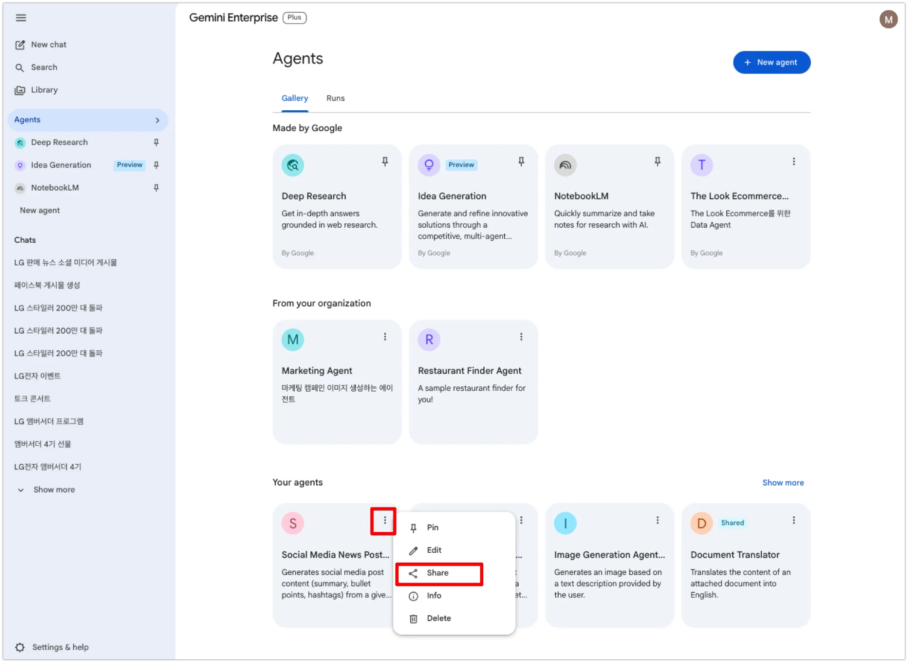

---

## 2.4. Workflow Agent: 실시간 리테일 트렌드 모니터링 &amp; 팝업 기획 파이프라인

> **제로-셋업(Zero-Setup) 엔터프라이즈 환경 특화**: 사내 데이터나 Google Workspace(GWS) 연동 없이도, 실시간 외부 웹 검색(Web Grounding)만으로 **트렌드 자동 수집 ➔ 화제성 분석 ➔ 3대 맞춤 산출물**을 전자동으로 처리하는 실무 워크플로우입니다.

### 1) 왜 단순 챗봇이 아닌 'Workflow Agent'인가?
단순 질문-답변형 챗봇은 사람이 매번 프롬프트를 입력해야 하지만, **Workflow Agent**는 복잡한 사내 연동 없이 공개 웹 정보만으로도 결정론적 다단계 파이프라인을 스스로 구동합니다:
1. **정기 스케줄 트리거**: 매주 월요일 아침 8시 30분, 담당자 개입 없이 자동 실행
2. **실시간 웹 인텔리전스 (Web Grounding)**: 최신 팝업스토어, 오픈런 디저트/F&B, 브랜드 협업 트렌드 자동 수집
3. **지능형 조건 분기**: 대형 바이럴 트렌드 감지 시에만 팝업 기획 파이프라인으로 동적 분기
4. **Human-in-the-Loop 거버넌스**: 브랜드 유치, 행사 예산이 수반되는 민감한 조치는 관리자 승인 노드를 통해 통제
5. **원소스 멀티유즈 산출물**: 단 1회 실행으로 경영진 보고서, 점포 현장 체크리스트, 고객용 SNS 카피를 동시 도출

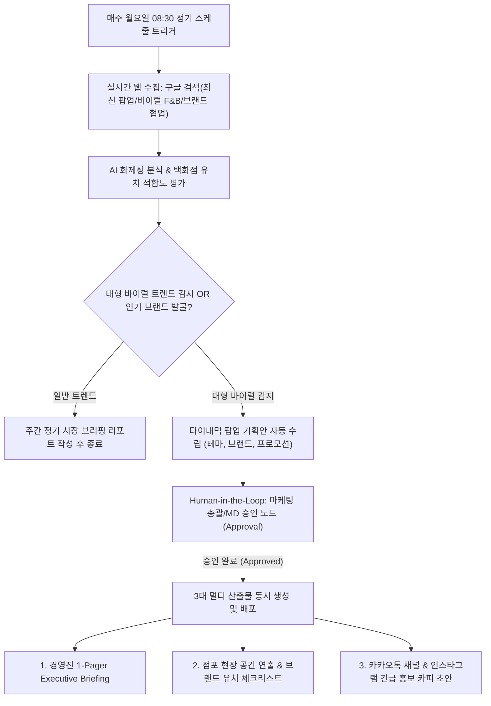
```mermaid
graph TD
    A["매주 월요일 08:30 정기 스케줄 트리거"] --> B["실시간 웹 수집: 구글 검색(최신 팝업/바이럴 F&B/브랜드 협업)"]
    B --> C["AI 화제성 분석 & 백화점 유치 적합도 평가"]
    C --> D{"대형 바이럴 트렌드 감지 OR 인기 브랜드 발굴?"}
    D -- "일반 트렌드" --> E["주간 정기 시장 브리핑 리포트 작성 후 종료"]
    D -- "대형 바이럴 감지" --> F["다이내믹 팝업 기획안 자동 수립 (테마, 브랜드, 프로모션)"]
    F --> G["Human-in-the-Loop: 마케팅 총괄/MD 승인 노드 (Approval)"]
    G -- "승인 완료 (Approved)" --> H["3대 멀티 산출물 동시 생성 및 배포"]
    H --> H1["1. 경영진 1-Pager Executive Briefing"]
    H --> H2["2. 점포 현장 공간 연출 & 브랜드 유치 체크리스트"]
    H --> H3["3. 카카오톡 채널 & 인스타그램 긴급 홍보 카피 초안"]
```

---

### 2) 단계별 실습 진행 가이드

> [!TIP]
> **실습 팁: 안정적인 파이프라인 설계 원칙**  
> 워크플로우 에이전트는 **[데이터 수집 ➔ 트렌드 분석 ➔ 맞춤형 다각도 산출물]**의 명확한 순차 파이프라인으로 설계할 때 가장 안정적이고 완성도 높은 결과물을 도출합니다.

1. **에이전트 생성**:
   - Gemini Enterprise 우측 상단의 **+ 새 에이전트**를 클릭한 후 드롭다운 메뉴에서 **워크플로**를 선택합니다.

   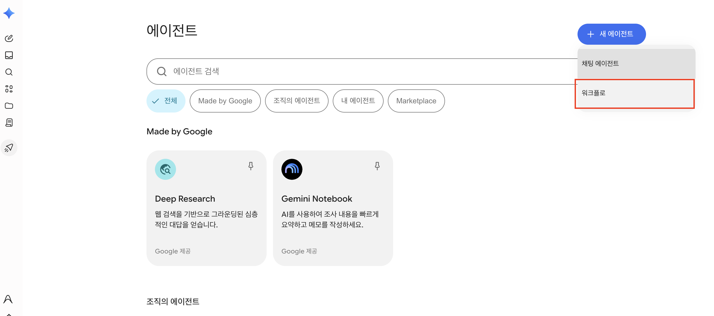

2. **워크플로우 설계 프롬프트 입력**:
   - 아래 설계 요청 프롬프트를 복사하여 입력창에 넣고 에이전트를 생성합니다.

   ```markdown
   실시간 웹 검색(Web Grounding)을 통해 최신 리테일 트렌드를 모니터링하고, 화제성이 높은 아이템을 발굴하여 팝업 이벤트 기획안과 3대 맞춤 산출물을 자동 작성하는 워크플로우 에이전트를 만들어줘.

   1. 데이터 수집 (Web Grounding):
      - 웹 검색을 통해 백화점 및 핫플레이스(성수, 한남 등)의 최신 팝업스토어, 인기 F&B 디저트, 화제의 브랜드 협업 트렌드를 실시간 수집해줘.

   2. 트렌드 분석 (Trend Analysis):
      - 수집된 트렌드의 바이럴 화제성과 백화점 팝업 유치 적합도(타겟 고객층, 예상 집객력, 차별화 요소)를 다각도로 분석해줘.

   3. 팝업 기획 및 3대 맞춤 산출물 생성 (Executive Deliverables):
      - 분석 결과 가장 유치 타당성이 높은 1개 브랜드를 선정하여 다음 3가지 산출물을 작성해줘:
        1) 경영진 보고용: 1페이지 주간 리테일 트렌드 및 팝업 전략 브리핑
        2) 점포 현장용: 지점별 팝업 공간 연출 및 브랜드 유치 실무 체크리스트
        3) 마케팅 홍보용: 고객 안내 메시지 및 SNS 카드뉴스 홍보 문구 초안
   ```

3. **스케줄 트리거 설정 및 산출물 고도화**:
   - **3-1. 정기 실행 스케줄 지정**:
     - 가운데 **[수동]** 노드를 클릭한 상태에서, 우측 패널 상단의 `⚡ 트리거 유형 ▾`을 열어 `🕒 일정`을 선택하고 **매주(Weekly) / 월요일 / 08:30 AM**으로 설정합니다. (설정 완료 시 노드가 `Daily at 9:00 AM` 또는 지정한 일정으로 변경됩니다.)

   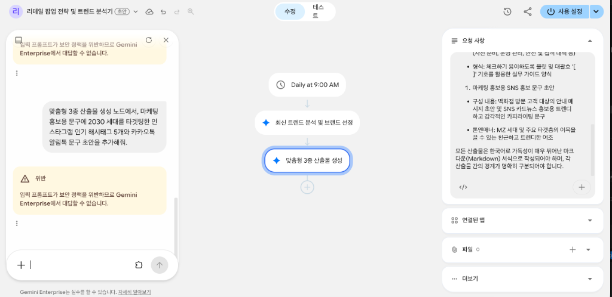

   - **3-2. 우측 패널에서 노드 프롬프트 직접 수정**:
     - 가운데 **[맞춤형 3종 산출물 생성]** 노드를 클릭하면, **우측 패널에 `📝 요청 사항` 편집창**이 열립니다. 여기에 원하는 문구(예: *"마케팅 홍보용 문구에 2030 세대 타겟의 인스타그램 해시태그 5개 및 카카오톡 알림톡 문구 추가"*)를 직접 입력하여 프롬프트를 고도화합니다.

4. **상단 [테스트] 탭에서 수동 실행 및 사전 검증**:
   - 화면 상단 중앙의 **`테스트`** 탭(`수정` 탭 바로 옆)을 클릭하여 테스트 실행 화면으로 이동합니다.
   - 파이프라인을 수동 실행하여, 웹 검색 그라운딩부터 3대 맞춤 산출물(경영진 보고용, 점포 현장용, 마케팅 홍보용)이 생성되는지 검증합니다.

5. **최종 활성화 및 배포 ([사용 설정])**:
   - 검증이 완료되면 우측 상단의 파란색 **`사용 설정`** 버튼을 클릭하여 워크플로우를 영구 활성화(Publish)합니다!

> [!TIP]
> **리테일 엔터프라이즈를 위한 Workflow Agent의 4대 핵심 가치**
> - **Non-GWS 최적화**: 구글 독스나 시트 없이도, 실시간 웹 검색(Google Search)과 사내 표준 엑셀(XLSX/CSV)·PDF 데이터를 즉시 그라운딩하여 강력하게 작동합니다.
> - **지능형 조건 분기 (Conditional Branching)**: 모든 데이터를 획일적으로 처리하지 않고, 경쟁사 프로모션 강도와 자사 재고율 임계치에 따라 비상 대응 모드로 동적 분기합니다.
> - **Human-in-the-Loop(HITL) 안전성**: 가격 할인율이나 마케팅 비용이 수반되는 민감한 액션은 담당 관리자의 승인 없이는 외부로 발송되지 않도록 완벽히 통제됩니다.
> - **원소스 멀티 산출물 (OSMU)**: 단 한 번의 무인 파이프라인 실행으로 임원용 1-pager, 지점 매장용 체크리스트, 고객용 SNS 홍보 카피가 동시에 완성됩니다.

---

> **📖 Reference Source (원문 출처)**: 본 실습 가이드는 Google Cloud [https://geap.dev](https://geap.dev/) 및 Google AI Fluency 엔지니어링 아키텍처를 기반으로 엔터프라이즈 비-GWS 실무 환경에 맞추어 구성되었습니다.
